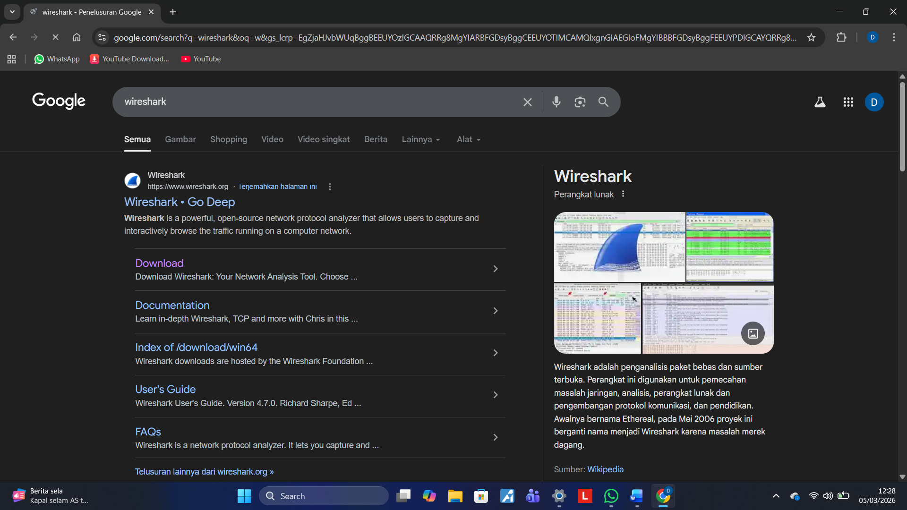

# Laporan Pratikum JK IF

## Tujuan Pratikum
Mempelajari Wireshark

## Langkah Percobaan
1. Masuk ke browser kalian ketik wireshark dan klik bagian download
2. Pilih sendiri sesuai OS yang kalian pakai masing-masing
3. Setelah itu Install, jika ada tombol next klik dan jika ada pilihan untung centang fitur itu disesuaikan kebutuhan masing masing.

## Lampiran
Hasil Percobaan:
