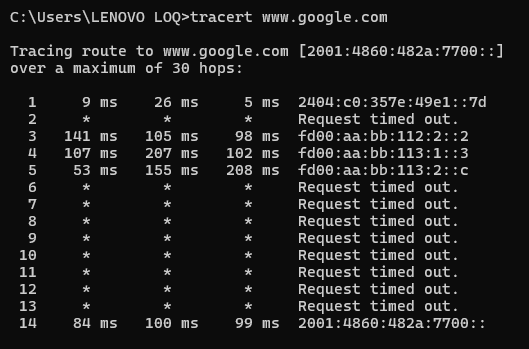
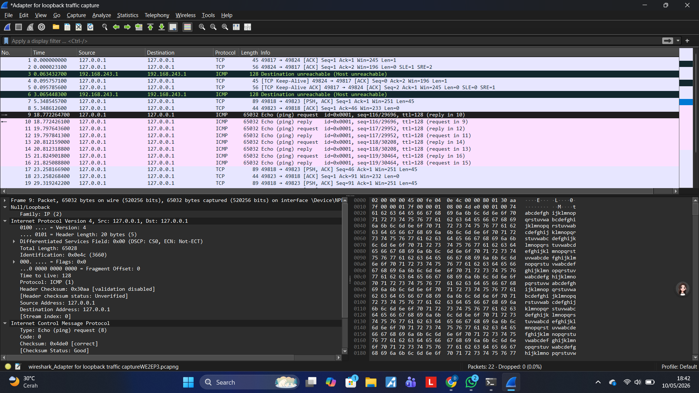
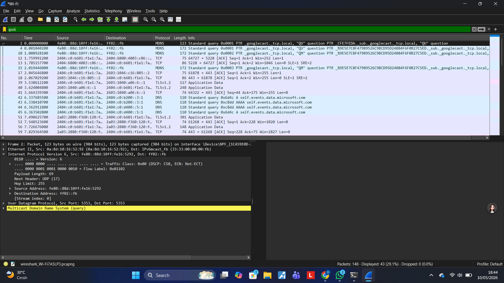

# Praktikum Jaringan Komputer Modul 10  
Analisis Traceroute, Fragmentasi IPv4, dan IPv6 menggunakan Wireshark

## Tujuan Praktikum
Praktikum ini bertujuan untuk memahami:
- Cara kerja traceroute
- Protokol ICMP, MTU, TTL
- Konsep fragmentasi paket IPv4
- Analisis paket IPv6 menggunakan Wireshark

---

## Tools yang Digunakan
- Wireshark
- Command Prompt / Terminal
- Internet Connection

---

## Dokumentasi Praktikum
### Traceroute

### Capture Wireshark

(../assets/image/week10_4.png)
### IPv6 Packet

---

## 📄 Laporan Lengkap

# Laporan Praktikum Modul 10 – Wireshark

---

# 1. Apa itu IP Address
IP Address adalah alamat unik yang digunakan untuk mengidentifikasi perangkat dalam jaringan.

Jenis IP Address:
- IPv4 → 32 bit (contoh: 192.168.1.1)
- IPv6 → 128 bit (contoh: 2001:4860:4860::8888)

IP Address berfungsi sebagai alamat tujuan pengiriman paket data.

---

# 2. Traceroute dari Website

## Perintah

Traceroute digunakan untuk mengetahui jalur router (hop) menuju server tujuan.

Traceroute bekerja dengan memanfaatkan TTL (Time To Live).  
Setiap router akan mengurangi TTL sebesar 1 hingga mencapai tujuan.

Ketika TTL habis, router mengirim pesan **ICMP Time Exceeded**.

---

# 3. ICMP, MTU, TTL

## ICMP
Digunakan untuk pesan kontrol jaringan:
- Ping (Echo Request & Reply)
- Error message
- Time exceeded

## MTU
Ukuran maksimum paket dalam jaringan.
MTU Ethernet standar = 1500 byte.

## TTL
Batas jumlah hop paket agar tidak looping di jaringan.

---

# 4. Fragmentasi IPv4

## Percobaan
Pengiriman paket besar menggunakan:
## Hasil
Fragmentasi tidak ditemukan pada Wireshark.

## Analisis
Hal ini terjadi karena jaringan modern menggunakan **Path MTU Discovery (PMTUD)**.

Router tidak memecah paket, melainkan menolak paket besar dan mengirim pesan ICMP Fragmentation Needed.

Faktor lain:
- Firewall jaringan
- Flag Don't Fragment aktif
- Kebijakan keamanan jaringan modern

Kesimpulan: Fragmentasi gagal diamati karena mekanisme keamanan jaringan modern.

---

# 5. Analisis IPv6

## Percobaan
Filter Wireshark:

## Hasil Pengamatan
Ditemukan paket IPv6 dengan field:
- Version = 6
- Traffic Class
- Flow Label
- Payload Length
- Hop Limit
- Source & Destination Address

## Keunggulan IPv6
- Address sangat banyak
- Header lebih sederhana
- Tidak menggunakan broadcast
- Mendukung autoconfiguration

---

# Kesimpulan
Praktikum ini memberikan pemahaman tentang:
1. Cara kerja traceroute
2. Fungsi ICMP dalam jaringan
3. Konsep MTU dan fragmentasi
4. Analisis paket IPv6 menggunakan Wireshark
