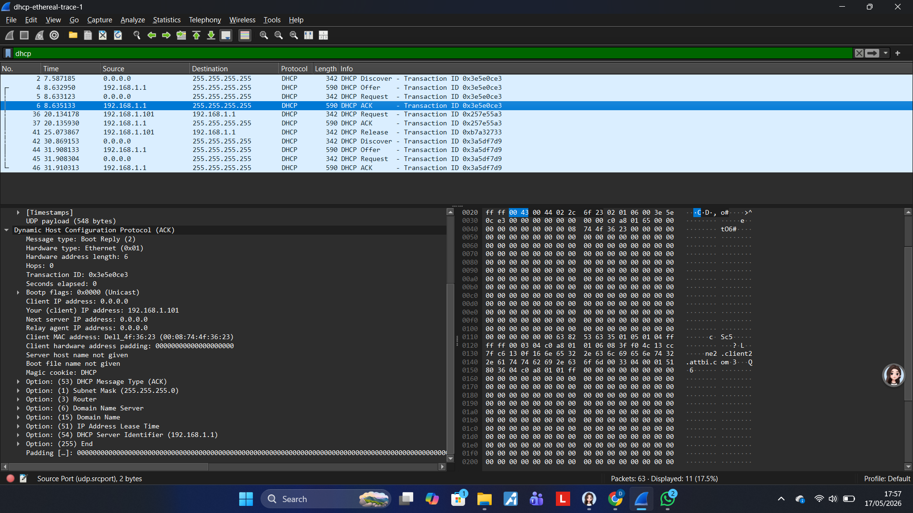
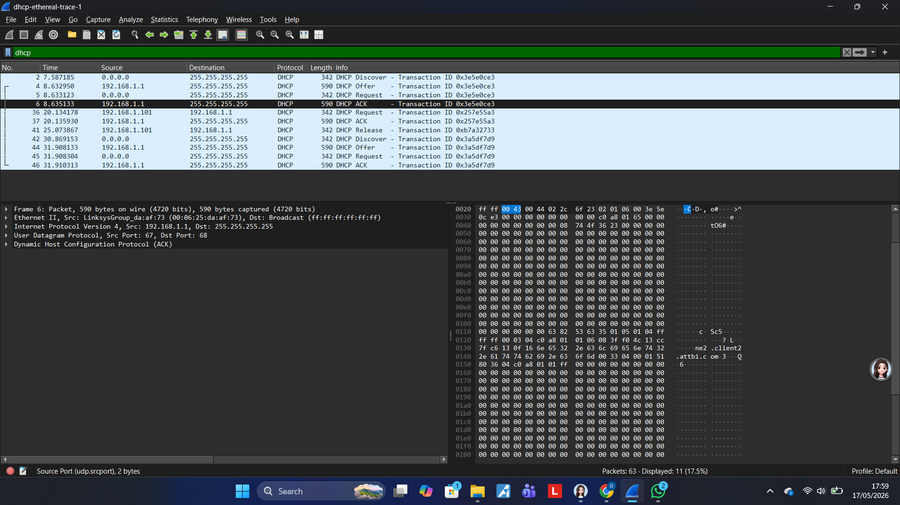

# LAPORAN PRAKTIKUM JARINGAN KOMPUTER
## MODUL 11: ANALISIS PROTOKOL DHCP (DYNAMIC HOST CONFIGURATION PROTOCOL)

---

## 1. Landasan Teori & Pengertian DHCP
**DHCP (Dynamic Host Configuration Protocol)** adalah protokol jaringan berbasis arsitektur *client/server* yang berfungsi untuk mengalokasikan parameter konfigurasi jaringan secara dinamis kepada perangkat (*host*) dalam jaringan komputer. Parameter tersebut meliputi alamat IP (*IP Address*), *Subnet Mask*, *Default Gateway*, dan *DNS Server*. 

Tanpa adanya DHCP, administrator jaringan harus melakukan konfigurasi secara manual (*static assignment*) pada setiap *endpoint*. Proses manual ini tidak efisien untuk jaringan skala besar dan rentan terhadap kesalahan manusia (*human error*). DHCP berjalan di atas protokol transport **UDP**, menggunakan **Port 67** untuk DHCP Server dan **Port 68** untuk DHCP Client.

---

## 2. Analisis Kelebihan dan Kekurangan DHCP

### A. Kelebihan (Plus)
1. **Otomatisasi & Efisiensi Manajemen:** Mempercepat proses distribusi konfigurasi jaringan ke ratusan atau ribuan perangkat secara simultan tanpa intervensi manual.
2. **Pencegahan Konflik IP (*IP Address Conflict*):** DHCP Server memiliki mekanisme pencatatan (*binding database*) untuk memastikan tidak ada dua perangkat yang menggunakan alamat IP yang sama pada segmen jaringan yang sama.
3. **Sentralisasi Pengaturan:** Jika terjadi perubahan infrastruktur (misalnya pergantian IP DNS Server atau Gateway), perubahan cukup dilakukan pada sisi server, dan seluruh klien akan memperbarui konfigurasinya secara otomatis saat masa sewa (*lease time*) diperbarui.
4. **Mobilitas Perangkat:** Perangkat dapat berpindah dari satu subnet ke subnet lain tanpa perlu konfigurasi ulang. IP yang ditinggalkan akan otomatis masuk kembali ke dalam *pool* untuk digunakan perangkat lain (*IP Address Reuse*).

### B. Kekurangan (Minus)
1. **Single Point of Failure (SPOF):** Jika infrastruktur server DHCP mengalami kendala (*down* atau mati), perangkat baru yang masuk ke dalam jaringan tidak akan mendapatkan alamat IP, sehingga terisolasi dari jaringan.
2. **Celah Keamanan (Vulnerability):**
   * *DHCP Starvation Attack:* Penyerang membanjiri server dengan permintaan IP palsu hingga stok IP habis.
   * *Rogue DHCP Server:* Penyerang membuat server DHCP palsu di jaringan untuk memberikan konfigurasi sesat (*gateway* palsu) guna melakukan serangan *Man-in-the-Middle (MitM)*.
3. **Ketidakcocokan untuk Host Kritis:** Perangkat infrastruktur utama seperti server database, printer jaringan, dan *router* tidak disarankan menggunakan DHCP dinamis biasa karena IP-nya harus bersifat statis agar layanannya tetap konsisten dapat diakses.

---

## 3. Alur Kerja Protokol DHCP (Proses DORA)
Proses pengetukan dan pemberian alamat IP antara klien dan server mengikuti empat tahapan utama yang disingkat **DORA**:

1. **Discover (DHCP Discover):** Klien yang belum memiliki IP mengirimkan pesan *broadcast* (`255.255.255.255`) ke jaringan untuk mencari DHCP Server yang tersedia.
2. **Offer (DHCP Offer):** Server DHCP yang mendengar pesan tersebut merespons dengan pesan penawaran alamat IP tertentu, beserta *lease time* dan parameter opsional lainnya.
3. **Request (DHCP Request):** Klien merespons balik secara *broadcast* untuk menerima penawaran dari server tersebut (dan secara tidak langsung menolak tawaran dari server lain jika ada lebih dari satu).
4. **Acknowledge (DHCP ACK):** Server mengirimkan pesan konfirmasi akhir, mencatat IP tersebut sebagai milik klien di database sewa, dan klien resmi dapat menggunakan IP tersebut.

---

## 4. Analisis dan Pembahasan Hasil Percobaan Wireshark
Berdasarkan hasil tangkapan paket (*packet capture*) pada Wireshark yang dilampirkan (`dhcp-ethereal-trace-1`), berikut adalah analisis mendalam terhadap lalu lintas data protokol DHCP.

### 4.1 Analisis Alur DORA pada Packet List Pane
Pada panel atas Wireshark, terlihat siklus lengkap jabat tangan (*handshake*) DHCP dengan nomor paket **2, 4, 5, dan 6** yang membentuk satu kesatuan proses DORA yang diidentifikasi oleh **Transaction ID: 0x3e5e0ce3**.

| No. Paket | Waktu (s) | Source IP | Destination IP | Info Utama | Deskripsi Tahapan |
| :---: | :---: | :---: | :---: | :---: | :--- |
| **2** | 7.587185 | `0.0.0.0` | `255.255.255.255` | DHCP Discover | **Discover:** Klien dengan IP kosong (`0.0.0.0`) melakukan *broadcast* mencari DHCP Server. |
| **4** | 8.632950 | `192.168.1.1` | `255.255.255.255` | DHCP Offer | **Offer:** Server `192.168.1.1` menawarkan IP address kepada klien. |
| **5** | 8.633123 | `0.0.0.0` | `255.255.255.255` | DHCP Request | **Request:** Klien mengajukan permohonan resmi untuk mengambil IP yang ditawarkan. |
| **6** | 8.635133 | `192.168.1.1` | `255.255.255.255` | DHCP ACK | **Acknowledge:** Server menyetujui peminjaman IP dan mengirimkan parameter konfigurasi lengkap. |

*Analisis Tambahan:* Selain siklus pertama, pada paket nomor 36 s.d. 46 terlihat adanya aktivitas DHCP lain (seperti *DHCP Release* pada paket 41, serta siklus DORA baru dengan Transaction ID berbeda: `0x257e55a3` dan `0x3a5df7d9`). Hal ini menunjukkan dinamika pelepasan dan pengambilan IP baru oleh klien di jaringan tersebut.

### 4.2 Analisis Detail Isi Paket DHCP ACK (Paket No. 6)
Melalui pembongkaran muatan (*payload*) pada paket nomor 6 (DHCP ACK) di jendela *Packet Details*, ditemukan data arsitektur jaringan konkret sebagai berikut:

#### A. Informasi Lapisan Data Link & Network (Screenshot 315)
* **Ethernet II Source MAC (Server):** `00:06:25:da:af:73` (Terdeteksi sebagai perangkat buatan manufaktur vendor *LinksysGroup*).
* **Ethernet II Destination MAC (Client):** `ff:ff:ff:ff:ff:ff` (Paket dikirim secara *Broadcast* ke seluruh segmen).
* **Internet Protocol Version 4 (IPv4):** Source IP adalah `192.168.1.1` (IP dari DHCP Server) dan Destination IP adalah `255.255.255.255` (*Network Broadcast*).
* **User Datagram Protocol (UDP):** Source Port menggunakan **67** (DHCP Server) dan Destination Port menggunakan **68** (DHCP Client).

#### B. Informasi Lapisan Aplikasi / Bootstrap Protocol (Screenshot 314)
Ketika struktur protokol DHCP dibongkar lebih dalam, elemen-elemen penting berikut berhasil diidentifikasi:
* **Message type:** `Boot Reply (2)` $
ightarrow$ Menandakan paket ini merupakan respons/balasan dari server (bukan *request* dari klien).
* **Hardware type:** `Ethernet (0x01)` dengan panjang physical address sepanjang 6 bytes.
* **Transaction ID:** `0x3e5e0ce3` $
ightarrow$ Token unik penanda bahwa paket ACK ini valid berpasangan dengan paket Discover-Offer-Request sebelumnya.
* **Client IP address:** `0.0.0.0` $
ightarrow$ Klien belum aktif menetapkan IP secara mandiri sebelum paket ACK ini diproses secara penuh.
* **Your (client) IP address:** `192.168.1.101` $
ightarrow$ **Alokasi IP Address Resmi** yang dipinjamkan oleh server kepada klien. Mulai detik ini, klien akan memiliki identitas IP `192.168.1.101`.
* **Client MAC address:** `00:08:74:4f:36:23` (Terbaca oleh Wireshark sebagai perangkat milik vendor *Dell*).
* **Magic cookie:** `DHCP` $
ightarrow$ Penanda standar opsi DHCP.

#### C. Analisis Opsi DHCP (DHCP Options Field)
Di bagian bawah *Bootstrap Protocol*, server menyertakan parameter-parameter konfigurasi tambahan melalui field opsi:
1. **Option (53) DHCP Message Type:** Bernilai `ACK`, mengonfirmasi bahwa status paket ini adalah peminjaman legal disetujui.
2. **Option (1) Subnet Mask:** Bernilai `255.255.255.0` (Artinya jaringan ini menggunakan prefiks kelas C atau `/24`).
3. **Option (3) Router:** Berisi alamat IP Gateway utama jaringan (bernilai `192.168.1.1` sesuai dengan IP server).
4. **Option (6) Domain Name Server:** Berisi daftar IP DNS server yang harus dirujuk klien untuk resolusi nama domain.
5. **Option (51) IP Address Lease Time:** Berisi durasi waktu (dalam satuan detik) seberapa lama klien diizinkan memegang IP `192.168.1.101` sebelum harus melakukan *renewal* (pembaruan sewa).
6. **Option (54) DHCP Server Identifier:** Bernilai `192.168.1.1`, mempertegas identitas unik server yang memberikan sewa ini.

---

## 5. Kesimpulan
Berdasarkan hasil praktikum dan analisis paket data menggunakan Wireshark, dapat disimpulkan bahwa:
1. Protokol DHCP bekerja secara terstruktur membebaskan administrator jaringan dari manajemen IP manual melalui otomatisasi yang andal.
2. Siklus **DORA (Discover, Offer, Request, ACK)** terekam dengan sempurna pada aktivitas paket jabat tangan nomor 2, 4, 5, dan 6 dengan pengikat berupa *Transaction ID* `0x3e5e0ce3`.
3. Dari hasil pembedahan paket DHCP ACK, diketahui bahwa server DHCP berada pada alamat IP `192.168.1.1` (*Linksys*) dan berhasil mengalokasikan alamat IPv4 `192.168.1.101` kepada klien (*Dell* dengan MAC `00:08:74:4f:36:23`) dengan subnet mask `255.255.255.0`.

## 6. Lampiran

 
