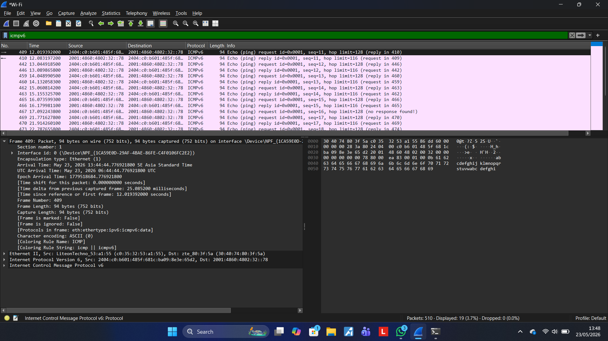
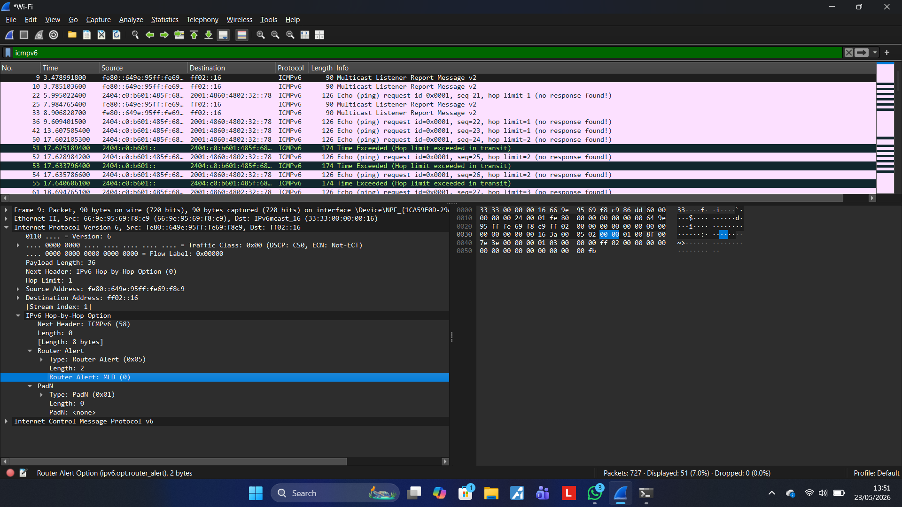

# Laporan Praktikum Jaringan Komputer – Modul 12  
## ICMP dan Traceroute Menggunakan Wireshark

---

# Tujuan Praktikum
1. Memahami cara kerja protokol ICMP menggunakan Wireshark  
2. Menganalisis paket ICMP dari program Ping  
3. Menganalisis paket ICMP dari program Traceroute  
4. Mengamati paket IPv6 pada Wireshark  

---

# Dasar Teori

## 1. ICMP (Internet Control Message Protocol)
ICMP adalah protokol jaringan yang digunakan untuk mengirim pesan kontrol dan error pada jaringan komputer.

ICMP digunakan pada:
- Ping
- Traceroute
- Error reporting jaringan

Contoh pesan ICMP:
- Echo Request
- Echo Reply
- Time Exceeded
- Destination Unreachable

---

## 2. Ping
Ping digunakan untuk mengecek apakah suatu host dapat dijangkau melalui jaringan.

Ping bekerja dengan cara:
1. Mengirim ICMP Echo Request
2. Host tujuan membalas Echo Reply

---

## 3. Traceroute
Traceroute digunakan untuk mengetahui jalur (hop/router) yang dilewati paket menuju host tujuan.

Traceroute memanfaatkan:
- TTL (Time To Live)
- ICMP Time Exceeded

---

# Langkah Praktikum

## A. Praktikum Ping dan ICMP

### 1. Membuka Wireshark
- Menjalankan aplikasi Wireshark
- Memilih interface Wi-Fi
- Menekan tombol Start Capture

---

### 2. Menjalankan Ping IPv6
Perintah yang digunakan:

```bash
ping -6 google.com
```

---

### 3. Filtering Paket ICMPv6
Pada Wireshark digunakan filter:

```text
icmpv6
```

---

## B. Praktikum Traceroute

### 1. Menjalankan Traceroute
Perintah yang digunakan:

```bash
tracert google.com
```

---

### 2. Mengamati Paket
Paket ICMPv6 diamati menggunakan Wireshark untuk melihat:
- Echo Request
- Echo Reply
- Time Exceeded

---

# Hasil Pengamatan

## 1. Hasil ICMPv6 Echo Request dan Reply
Pada hasil capture Wireshark ditemukan paket:

- ICMPv6 Echo Request
- ICMPv6 Echo Reply

Informasi paket:
- Protocol : ICMPv6
- Hop Limit : 128
- Source Address : IPv6 Client
- Destination Address : IPv6 Google

Wireshark berhasil menangkap komunikasi ICMPv6 antara client dan server Google menggunakan IPv6.

---

## 2. Hasil Time Exceeded
Pada hasil traceroute ditemukan paket:

```text
Time Exceeded (Hop limit exceeded in transit)
```

Hal ini menunjukkan bahwa:
- Nilai Hop Limit habis
- Router mengirim pesan ICMPv6 Time Exceeded
- Traceroute berhasil mengetahui jalur router menuju tujuan

---

# Analisis Praktikum

## Analisis ICMPv6
Dari hasil praktikum dapat diketahui bahwa:
- Ping menggunakan ICMPv6 Echo Request dan Echo Reply
- Paket berhasil dikirim dan diterima
- Wireshark dapat membaca detail paket IPv6

Field penting yang diamati:
- Version = 6
- Hop Limit
- Source Address
- Destination Address

---

## Analisis Traceroute
Traceroute bekerja dengan memanfaatkan Hop Limit (TTL pada IPv4).

Setiap router:
- Mengurangi Hop Limit sebesar 1
- Jika Hop Limit habis → router mengirim ICMPv6 Time Exceeded

Dengan cara tersebut traceroute dapat mengetahui jalur router yang dilewati paket.

---

# Kesimpulan
Dari praktikum ini dapat disimpulkan bahwa:

1. ICMP digunakan sebagai protokol kontrol jaringan  
2. Ping menggunakan ICMP Echo Request dan Echo Reply  
3. Traceroute menggunakan mekanisme Hop Limit/TTL  
4. Wireshark dapat digunakan untuk menganalisis paket jaringan secara detail  
5. IPv6 menggunakan ICMPv6 untuk komunikasi kontrol jaringan  

---

# Dokumentasi
dokumentasi praktikum:
- Screenshot ICMPv6 Echo Request & Reply
 
- Screenshot Time Exceeded
 
- Screenshot Wireshark Filter icmpv6
 

---