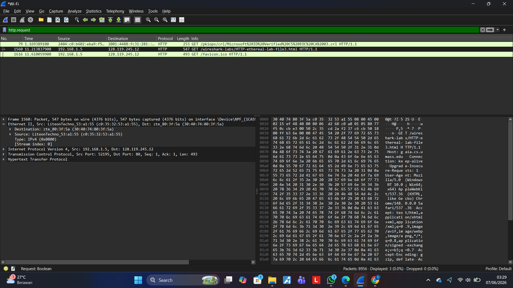
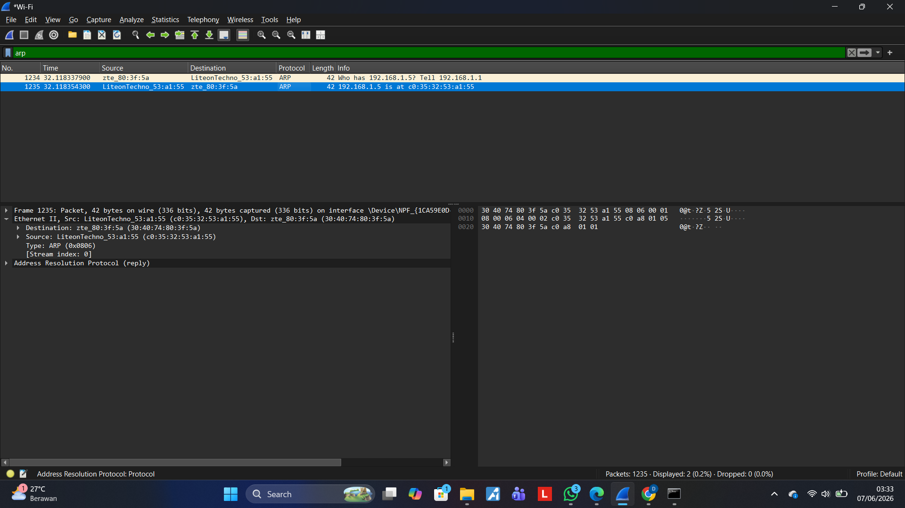

#  Laporan Praktikum — Analisis Frame Ethernet & ARP dengan Wireshark

> **Modul 13 · Jaringan Komputer**
> Tanggal Praktikum: 07 Juni 2026

---

##  Daftar Isi

- [Tujuan Praktikum](#tujuan-praktikum)
- [Alat dan Bahan](#alat-dan-bahan)
- [Bagian 1 — Analisis Frame Ethernet](#bagian-1--analisis-frame-ethernet)
- [Bagian 2 — Pengamatan ARP](#bagian-2--pengamatan-arp)
- [Analisis dan Pembahasan](#analisis-dan-pembahasan)
- [Kesimpulan](#kesimpulan)

---

##  Tujuan Praktikum

1. Menganalisis struktur frame Ethernet menggunakan Wireshark.
2. Mengamati cara kerja protokol ARP (*Address Resolution Protocol*) pada jaringan lokal.
3. Memahami hubungan antara alamat IP dan alamat MAC dalam komunikasi jaringan.

---

##  Alat dan Bahan

| Alat / Software | Versi / Keterangan |
|---|---|
| Wireshark | Versi terbaru (dengan Npcap) |
| Browser | Google Chrome / Firefox |
| Sistem Operasi | Windows 11 |
| Koneksi Jaringan | Wi-Fi |
| URL Target | `http://gaia.cs.umass.edu/wireshark-labs/HTTP-wireshark-file3.html` |

---

## Bagian 1 — Analisis Frame Ethernet

### Langkah-Langkah

1. Membuka Wireshark dan memilih interface **Wi-Fi**.
2. Memulai *capture* paket.
3. Membuka URL: `http://gaia.cs.umass.edu/wireshark-labs/HTTP-wireshark-file3.html`
4. Menghentikan *capture* setelah halaman terbuka.
5. Memfilter paket menggunakan: `http.request`
6. Memilih paket **HTTP GET** menuju server target.
7. Mengekspansi bagian **Ethernet II** pada panel detail paket.

### Hasil Capture



*Gambar 1: Hasil filter `http.request` — paket HTTP GET terlihat pada baris No. 1560*

---

### Data Frame Ethernet (Paket No. 1560)

| Field | Nilai |
|---|---|
| **No. Paket** | 1560 |
| **Source IP** | 192.168.1.5 |
| **Destination IP** | 128.119.245.12 |
| **Protocol** | HTTP |
| **Info** | `GET /wireshark-labs/HTTP-ethereal-lab-file3.html HTTP/1.1` |

#### Detail Ethernet II

| Field | Nilai |
|---|---|
| **Destination MAC** | `30:40:74:80:3f:5a` (zte_80:3f:5a) |
| **Source MAC** | `c0:35:32:53:a1:55` (LiteonTechno_53:a1:55) |
| **EtherType** | `0x0800` (IPv4) |

---

### Jawaban Pertanyaan — Bagian 1

**Q: Berapa MAC Address sumber pada frame HTTP GET?**

> `c0:35:32:53:a1:55` — Ini adalah MAC Address adapter Wi-Fi pada komputer yang digunakan.

**Q: Berapa MAC Address tujuan pada frame HTTP GET?**

> `30:40:74:80:3f:5a` — Ini adalah MAC Address router/gateway jaringan lokal, bukan MAC Address server `gaia.cs.umass.edu` secara langsung, karena server tersebut berada di luar jaringan lokal.

**Q: Berapa nilai EtherType?**

> `0x0800` — Nilai ini menunjukkan bahwa payload frame Ethernet membawa paket **IPv4**.

---

## Bagian 2 — Pengamatan ARP

### Langkah-Langkah

1. Membuka Command Prompt sebagai Administrator.
2. Menjalankan `arp -a` untuk melihat ARP cache awal.
3. Menghapus ARP cache dengan perintah `arp -d *`.
4. Memulai *capture* Wireshark kembali pada interface Wi-Fi.
5. Membuka kembali URL target.
6. Menghentikan *capture*.
7. Memfilter paket dengan: `arp`
8. Menganalisis paket ARP Request dan ARP Reply.

### Hasil Capture



*Gambar 2: Hasil filter `arp` — terlihat ARP Request (No. 1234) dan ARP Reply (No. 1235)*

---

### Data Paket ARP

#### ARP Request (Paket No. 1234)

| Field | Nilai |
|---|---|
| **Source** | `zte_80:3f:5a` (Router/Gateway) |
| **Destination** | `LiteonTechno_53:a1:55` (Komputer) |
| **Info** | `Who has 192.168.1.5? Tell 192.168.1.1` |
| **Arah** | Router → Broadcast ke komputer |

#### ARP Reply (Paket No. 1235)

| Field | Nilai |
|---|---|
| **Source** | `LiteonTechno_53:a1:55` (Komputer) |
| **Destination** | `zte_80:3f:5a` (Router/Gateway) |
| **Info** | `192.168.1.5 is at c0:35:32:53:a1:55` |
| **Arah** | Komputer → Router (Unicast) |

#### Detail Ethernet II (ARP Reply)

| Field | Nilai |
|---|---|
| **Destination MAC** | `30:40:74:80:3f:5a` (zte_80:3f:5a) |
| **Source MAC** | `c0:35:32:53:a1:55` (LiteonTechno_53:a1:55) |
| **EtherType** | `0x0806` (ARP) |

---

### Jawaban Pertanyaan — Bagian 2

**Q: Apa fungsi ARP?**

> ARP (*Address Resolution Protocol*) berfungsi untuk menerjemahkan alamat IP menjadi alamat MAC (Physical Address) agar paket data dapat dikirimkan pada level jaringan lokal (Layer 2).

**Q: Apa perbedaan ARP Request dan ARP Reply?**

| | ARP Request | ARP Reply |
|---|---|---|
| **Tujuan** | Menanyakan MAC Address | Memberikan MAC Address |
| **Dikirim ke** | Broadcast (`ff:ff:ff:ff:ff:ff`) | Unicast (langsung ke penanya) |
| **Pengirim** | Perangkat yang butuh info MAC | Perangkat pemilik IP yang ditanya |

**Q: Mengapa ARP Request dikirim secara broadcast?**

> Karena pengirim belum mengetahui MAC Address tujuan. Dengan broadcast, semua perangkat dalam satu jaringan lokal menerima pertanyaan tersebut, dan hanya perangkat dengan IP yang sesuai yang akan membalas.

**Q: Apa yang terjadi setelah ARP Reply diterima?**

> MAC Address yang diterima dari ARP Reply akan disimpan di **ARP Cache** komputer. Penyimpanan ini bersifat sementara agar tidak perlu melakukan ARP Request berulang kali untuk tujuan yang sama, sehingga efisiensi jaringan meningkat.

---

##  Analisis dan Pembahasan

### Alur Komunikasi yang Teramati

```
Komputer (192.168.1.5)
        │
        │  [1] ARP Request (Broadcast)
        │  "Who has 192.168.1.5? Tell 192.168.1.1"
        ▼
    Router/Gateway (192.168.1.1)
        │
        │  [2] ARP Reply (Unicast)
        │  "192.168.1.5 is at c0:35:32:53:a1:55"
        ▼
Komputer menyimpan di ARP Cache
        │
        │  [3] HTTP GET Request (Frame Ethernet)
        │  Src MAC: c0:35:32:53:a1:55
        │  Dst MAC: 30:40:74:80:3f:5a (Gateway)
        ▼
    Server gaia.cs.umass.edu (128.119.245.12)
```

### Poin Penting

- **MAC Address Destination pada HTTP GET** bukan milik server tujuan (`gaia.cs.umass.edu`), melainkan milik **default gateway** (router). Hal ini terjadi karena komunikasi antar jaringan yang berbeda melewati router terlebih dahulu.
- **EtherType `0x0800`** mengindikasikan IPv4, sementara **`0x0806`** mengindikasikan ARP — keduanya beroperasi pada Layer 2 (Data Link Layer).
- Setelah ARP selesai, komunikasi HTTP dapat langsung berjalan tanpa ARP Request ulang karena MAC Address sudah tersimpan di cache.

---

##  Kesimpulan

1. **Frame Ethernet** terdiri dari MAC Address sumber, MAC Address tujuan, dan EtherType yang menentukan protokol layer atas yang dibawa.
2. **ARP** berperan krusial dalam memetakan IP Address ke MAC Address sebelum data dapat dikirim di jaringan lokal.
3. **ARP Request** bersifat broadcast sedangkan **ARP Reply** bersifat unicast, mencerminkan prinsip efisiensi jaringan.
4. Pada komunikasi ke internet, **destination MAC Address selalu merupakan MAC gateway**, bukan MAC server tujuan akhir.

---

##  Struktur Repository

```
.
├── README.md               ← Laporan utama (file ini)
├── Screenshot__321_.png    ← Capture Wireshark HTTP Request
└── Screenshot__324_.png    ← Capture Wireshark ARP
```

---

*Laporan ini dibuat sebagai dokumentasi praktikum Jaringan Komputer — Modul 13.*