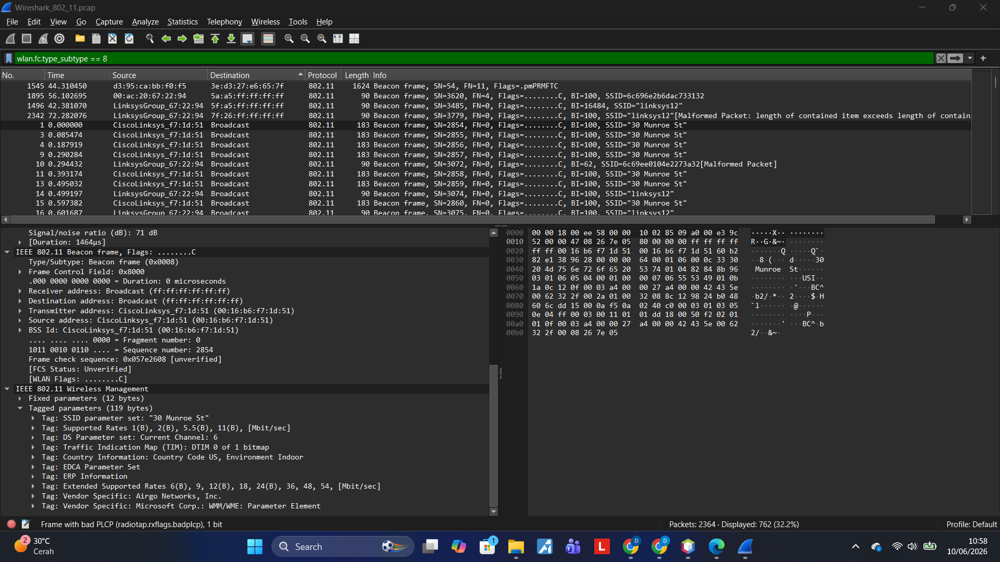
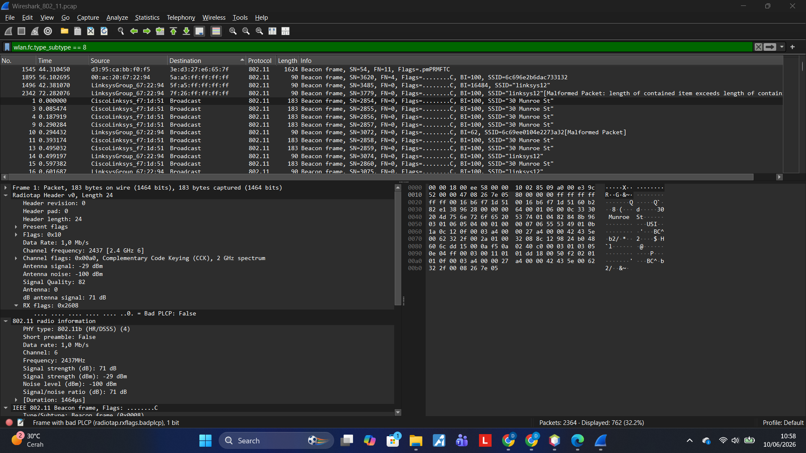

#  Laporan Praktikum — Analisis WiFi 802.11 dengan Wireshark

> **Modul 14 · Jaringan Komputer**
> Tanggal Praktikum: 10 Juni 2026

---

##  Daftar Isi

- [Tujuan Praktikum](#tujuan-praktikum)
- [Alat dan Bahan](#alat-dan-bahan)
- [Bagian 1 — Persiapan File Capture](#bagian-1--persiapan-file-capture)
- [Bagian 2 — Analisis Beacon Frame](#bagian-2--analisis-beacon-frame)
- [Analisis dan Pembahasan](#analisis-dan-pembahasan)
- [Kesimpulan](#kesimpulan)

---

##  Tujuan Praktikum

1. Memahami struktur frame pada jaringan WiFi standar IEEE 802.11.
2. Menganalisis Beacon Frame yang dikirim oleh Access Point (AP).
3. Mengidentifikasi informasi jaringan WiFi seperti SSID, channel, dan MAC Address AP.

---

##  Alat dan Bahan

| Alat / Software | Keterangan |
|---|---|
| Wireshark | Versi terbaru (dengan Npcap) |
| File Capture | `Wireshark_802_11.pcap` |
| Sumber File | `http://gaia.cs.umass.edu/wireshark-labs/wireshark-traces.zip` |
| Sistem Operasi | Windows 11 |

---

## Bagian 1 — Persiapan File Capture

### Langkah-Langkah

1. Download file `wireshark-traces.zip` dari URL yang disediakan.
2. Ekstrak ZIP dan temukan file `Wireshark_802_11.pcap`.
3. Buka Wireshark → **File → Open** → pilih file tersebut.
4. Setelah terbuka, terlihat banyak paket dengan protokol **IEEE 802.11**.

> **Catatan:** Pada praktikum ini tidak dilakukan capture secara langsung, melainkan menggunakan file `.pcap` yang telah disediakan oleh modul.

---

## Bagian 2 — Analisis Beacon Frame

### Apa itu Beacon Frame?

Beacon frame adalah paket manajemen yang dikirim secara periodik oleh Access Point (AP) untuk mengumumkan keberadaan jaringan WiFi kepada perangkat di sekitarnya. Beacon berisi informasi seperti nama jaringan (SSID), channel, kecepatan yang didukung, dan parameter keamanan.

### Langkah Analisis

1. Pada kolom filter Wireshark, ketik:
   ```
   wlan.fc.type_subtype == 8
   ```
2. Tekan Enter — hanya Beacon Frame yang akan ditampilkan.
3. Klik paket beacon (Frame 1 / paket awal) untuk melihat detailnya.
4. Pada panel detail, ekspansi bagian:
   - `IEEE 802.11 Beacon frame`
   - `IEEE 802.11 Wireless Management` → `Tagged parameters`

### Hasil Capture



*Gambar 1: Detail Beacon Frame — Tagged Parameters menampilkan SSID "30 Munroe St", Channel 6, dan informasi jaringan lainnya*



*Gambar 2: Radiotap Header dan 802.11 radio information — menampilkan data sinyal fisik seperti frekuensi, channel, dan kekuatan sinyal*

---

### Data Beacon Frame (Frame 1)

#### Informasi Umum

| Field | Nilai |
|---|---|
| **No. Paket** | 1 |
| **Waktu** | 0.000000 |
| **Source** | CiscoLinksys_f7:1d:51 |
| **Destination** | Broadcast |
| **Protocol** | 802.11 |
| **Panjang** | 183 bytes |

#### Radiotap Header (Informasi Fisik)

| Field | Nilai |
|---|---|
| **Header Length** | 24 bytes |
| **Data Rate** | 1.0 Mb/s |
| **Channel Frequency** | 2437 MHz |
| **Channel** | 6 |
| **PHY Type** | 802.11b (HR/DSSS) |
| **Antenna Signal** | -29 dBm |
| **Antenna Noise** | -100 dBm |
| **Signal Strength (dB)** | 71 dB |
| **Signal/Noise Ratio** | 71 dB |

#### IEEE 802.11 Beacon Frame

| Field | Nilai |
|---|---|
| **Type/Subtype** | Beacon frame (0x0008) |
| **Receiver Address** | Broadcast (ff:ff:ff:ff:ff:ff) |
| **Destination Address** | Broadcast (ff:ff:ff:ff:ff:ff) |
| **Transmitter Address** | `00:16:b6:f7:1d:51` (CiscoLinksys_f7:1d:51) |
| **Source Address** | `00:16:b6:f7:1d:51` (CiscoLinksys_f7:1d:51) |
| **BSS Id** | `00:16:b6:f7:1d:51` (CiscoLinksys_f7:1d:51) |
| **Sequence Number** | 2854 |

#### Tagged Parameters (Isi Manajemen Beacon)

| Tag | Nilai |
|---|---|
| **SSID** | `30 Munroe St` |
| **Supported Rates** | 1(B), 2(B), 5.5(B), 11(B) Mbit/s |
| **Current Channel** | 6 |
| **Country Code** | US (United States) |
| **Environment** | Indoor |
| **Extended Supported Rates** | 6(B), 9, 12(B), 18, 24(B), 36, 48, 54 Mbit/s |
| **Vendor** | Airgo Networks, Inc. |
| **Vendor** | Microsoft Corp. — WMM/WME Parameter Element |

---

### Beacon Frame Lain yang Terdeteksi

Selain AP `30 Munroe St`, terdeteksi pula AP lain dalam jangkauan:

| SSID | MAC Address AP | Keterangan |
|---|---|---|
| `30 Munroe St` | `00:16:b6:f7:1d:51` (CiscoLinksys) | AP utama yang digunakan |
| `linksys12` | `00:0c:67:22:94` (LinksysGroup) | AP lain yang terdeteksi |
| *(unknown)* | `00:ac:20:67:22:94` | AP dengan SSID `6c696e...` |

---

##  Analisis dan Pembahasan

### Jawaban Pertanyaan Praktikum

**Q: Apa fungsi Beacon Frame?**

> Beacon frame digunakan Access Point untuk mengumumkan keberadaan jaringan WiFi kepada perangkat di sekitarnya secara periodik. Beacon berisi SSID, channel, kecepatan yang didukung, serta parameter keamanan agar perangkat lain dapat mengenali dan terhubung ke jaringan tersebut.

**Q: Mengapa destination pada Beacon Frame adalah Broadcast?**

> Karena beacon ditujukan kepada semua perangkat yang berada dalam jangkauan AP, bukan kepada satu perangkat tertentu. Dengan dikirim ke alamat broadcast (`ff:ff:ff:ff:ff:ff`), semua perangkat dapat mendeteksi keberadaan jaringan WiFi tersebut.

**Q: Berapa MAC Address AP "30 Munroe St"?**

> `00:16:b6:f7:1d:51` — ditampilkan sebagai `CiscoLinksys_f7:1d:51` pada Wireshark, menunjukkan bahwa perangkat ini adalah router/AP merek Cisco Linksys.

**Q: Berapa channel yang digunakan AP "30 Munroe St"?**

> Channel **6**, beroperasi pada frekuensi **2437 MHz** (band 2.4 GHz).

**Q: Berapa kecepatan data yang didukung?**

> Kecepatan dasar (Basic Rates): 1, 2, 5.5, 11 Mbit/s (802.11b).
> Kecepatan extended: 6, 9, 12, 18, 24, 36, 48, 54 Mbit/s (802.11g).

### Struktur Komunikasi WiFi yang Teramati

```
Access Point (CiscoLinksys_f7:1d:51)
        │
        │  Beacon Frame (setiap ~100ms / BI=100)
        │  Destination: Broadcast (ff:ff:ff:ff:ff:ff)
        │  SSID: "30 Munroe St"
        │  Channel: 6 | Freq: 2437 MHz
        ▼
Semua Perangkat WiFi di Sekitar
(Dapat mendeteksi dan memilih untuk bergabung)
```

### Catatan Mengenai Keterbatasan Praktikum

Pada file `.pcap` yang tersedia, analisis difokuskan pada **Beacon Frame** (filter `wlan.fc.type_subtype == 8`). Bagian-bagian berikut **tidak tersedia** dalam file capture yang digunakan:

| Bagian | Status | Keterangan |
|---|---|---|
| Data Transfer (t=24.82 & t=32.82) | ❌ Tidak tersedia | Frame data tidak ditemukan pada timestamp tersebut |
| Association Request/Response | ❌ Tidak tersedia | Paket subtype 0 dan 1 tidak ada dalam capture |
| Disassociation | ❌ Tidak tersedia | Paket subtype 10 tidak ada dalam capture |

---

##  Kesimpulan

1. **Beacon Frame** adalah mekanisme utama AP untuk memperkenalkan diri kepada perangkat di sekitarnya, dikirim secara broadcast secara periodik (setiap Beacon Interval = 100ms).
2. AP **"30 Munroe St"** menggunakan MAC Address `00:16:b6:f7:1d:51`, beroperasi pada **channel 6** (2437 MHz), dan mendukung standar **802.11b/g**.
3. **Radiotap Header** menyediakan informasi fisik seperti kekuatan sinyal (-29 dBm), noise level (-100 dBm), dan SNR (71 dB) yang berguna untuk analisis kualitas jaringan nirkabel.
4. Dalam satu area dapat terdeteksi beberapa AP sekaligus (dalam capture ini terlihat `30 Munroe St` dan `linksys12`), yang menunjukkan kemampuan 802.11 dalam lingkungan multi-AP.

---

##  Struktur Repository

```
.
├── README.md                  ← Laporan utama (file ini)
├── Screenshot__331_.png       ← Radiotap Header & 802.11 Radio Info
└── Screenshot__332_.png       ← Beacon Frame Tagged Parameters
```

---

*Laporan ini dibuat sebagai dokumentasi praktikum Jaringan Komputer — Modul 14.*