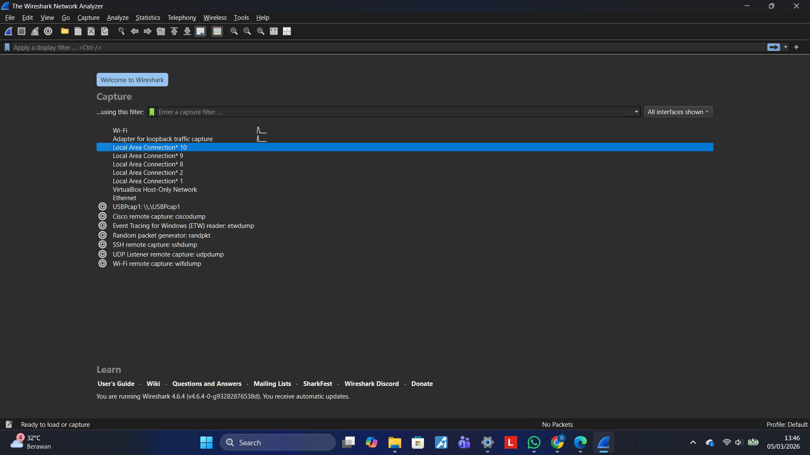
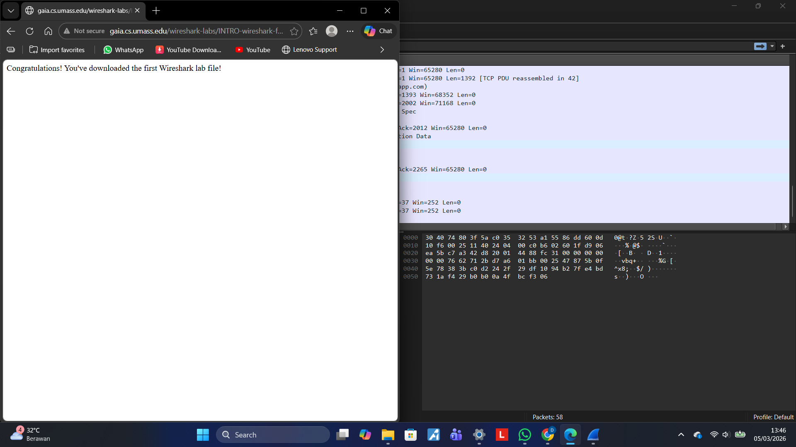
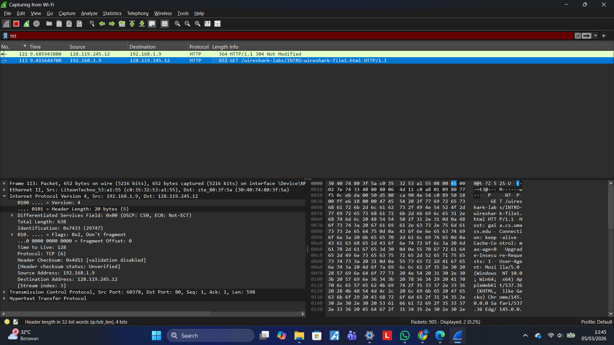

# Laporan Pratikum JK IF

## Tujuan Pratikum
Mempelajari Jarkom

## Langkah Percobaan
1. Tes Wireshark untuk http 
2. Salin link testing yang ada didalam modul, disini link berbentuk https jika tidak bisa dibaca maka hapus bagian s nya.
3. kalian cari di wireshark http maka akan keluar apa yang kita running tadi.

## Lampiran
Hasil Percobaan:

