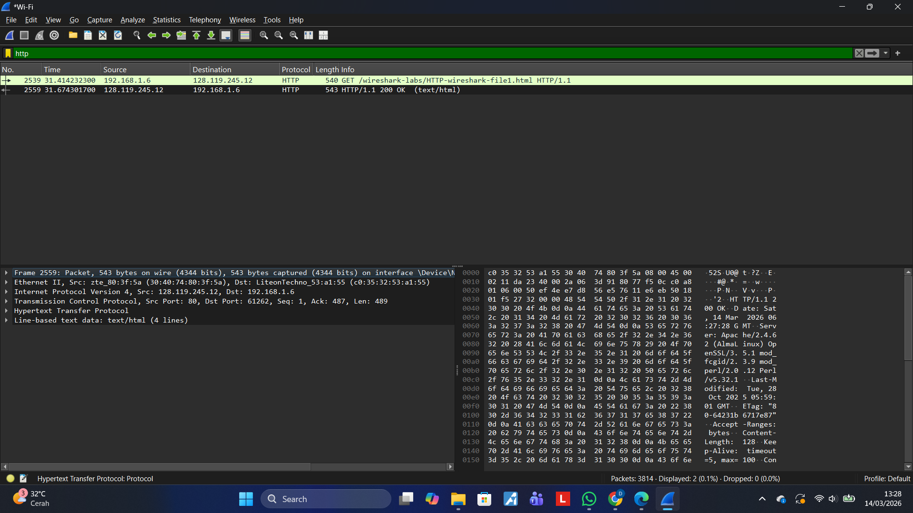
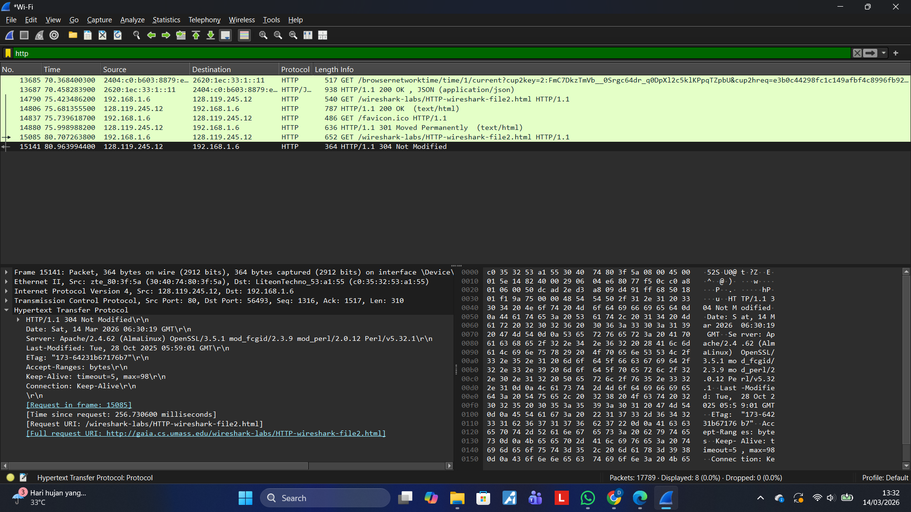
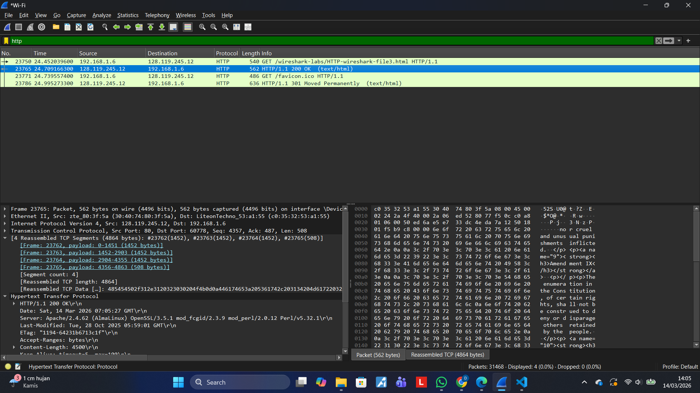
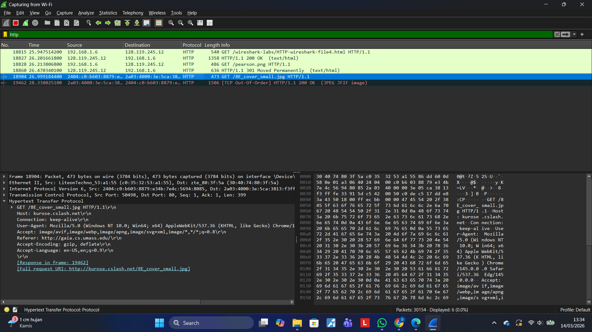
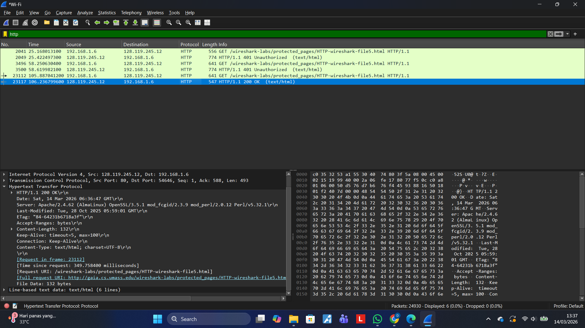

# Laporan Pratikum JK IF

## Tujuan Pratikum
Mempelajari Wireshark/HTTP

## Langkah Percobaan
1. Basic HTTP GET/response interaction. 
2. HTTP CONDITIONAL GET/response interaction
3. Retrieving Long Documents
4. HTML Documents dengan Embedded Objects
5. HTTP Authentication

## Lampiran
Hasil Percobaan:

