# Laporan Pratikum JK IF

## Tujuan Pratikum
Mempelajari Wireshark/DNS

## Langkah Percobaan/Jawaban Nslookup
1. Dilakukan pencarian alamat IP domain www.nus.edu.sg menggunakan perintah nslookup dengan DNS publik Google (8.8.8.8). Hasil menunjukkan bahwa domain berhasil diterjemahkan menjadi beberapa alamat IP, sehingga proses resolusi DNS berjalan dengan baik.

Kesimpulan: Alamat IP server web di Asia berhasil diperoleh melalui proses DNS lookup.

2. Dilakukan query tipe NS terhadap domain ox.ac.uk untuk mengetahui server DNS otoritatif. Hasil menunjukkan beberapa name server yang bertanggung jawab terhadap domain tersebut, seperti dns0.ox.ac.uk, dns1.ox.ac.uk, dan lainnya.

Kesimpulan: Server DNS otoritatif domain ox.ac.uk berhasil diidentifikasi menggunakan record NS.

3. Query MX terhadap yahoo.com melalui DNS ox.ac.uk menghasilkan query refused karena server tersebut bersifat authoritative dan hanya melayani domain dalam otoritasnya. Selanjutnya query dilakukan menggunakan DNS publik Google untuk memperoleh mail server Yahoo, kemudian dilakukan lookup kembali untuk mendapatkan alamat IP salah satu mail server.

Kesimpulan: Mail server Yahoo beserta alamat IP-nya berhasil diperoleh menggunakan record MX dan proses DNS lookup lanjutan.

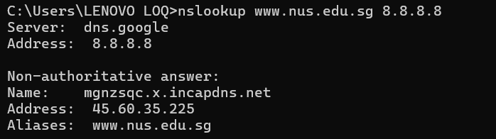
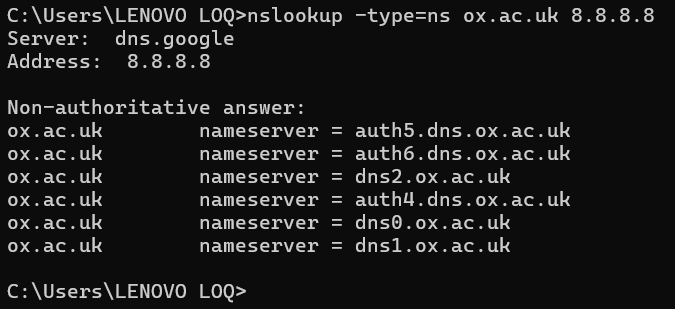
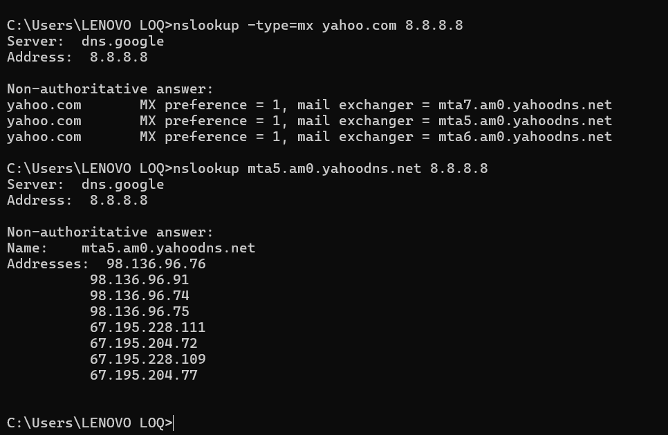

## Langkah Percobaan/Jawaban Ipconfig

1. memperoleh semua informasi tentang host Anda hanya dengan memasukkan: ipconfig \all

2.  catatan DNS yang baru saja diperolehnya. Untuk melihat record yang telah disimpan, setelah prompt C:\> masukkan perintah berikut: ipconfig /displaydns

3. Hasil yang didapatkan akan menampilkan record dan sisa Time To Live (TTL) dalam satuan detik. Untuk menghapus cacatan, masukkan: ipconfig /flushdns 

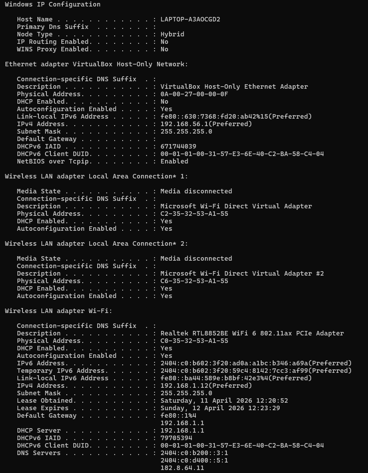
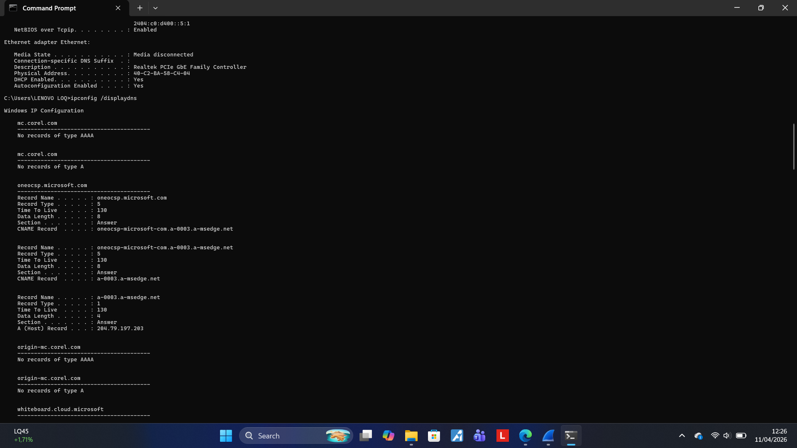
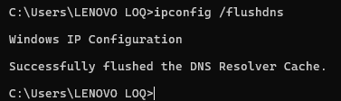

## Langkah Percobaan/Jawaban Tracing DNS dengan Wireshark

1. Pesan permintaan DNS dan balasannya dikirim melalui UDP atau TCP?
Jawaban: Dikirim melalui UDP.
Bukti: Lihat Screenshot (4_8). Pada bagian detail paket tertulis "User Datagram Protocol".

2. Apa port tujuan pada pesan permintaan DNS? Apa port sumber pada pesan balasannya?
Jawaban: Port tujuan permintaan adalah 53, dan port sumber balasannya adalah 53.
Bukti: Lihat Screenshot (4_8). Source Port: 53 dan Dest Port: 55117. (Ingat: DNS selalu menggunakan Port 53 sebagai standarnya).

3. Pada pesan permintaan DNS, apa alamat IP tujuannya? Apa alamat IP server DNS lokal anda? Apakah keduanya sama?
Jawaban: IP tujuannya adalah 182.8.64.11. Ya, keduanya sama karena komputer mengirim permintaan langsung ke DNS server tersebut.
Bukti: Lihat Screenshot (4_7). Destination Address: 182.8.64.11.

4. Periksa pesan permintaan DNS. Apa "jenis" atau "type" dari pesan tersebut? Apakah mengandung "jawaban" atau "answers"?
Jawaban: Jenisnya adalah Type A (untuk IPv4). Pesan permintaan tidak mengandung jawaban (Answers: 0).
Bukti: Kamu bisa melihat ini jika mengklik paket 2802 (Permintaan), di bagian Queries akan tertulis Type: A.

5. Periksa pesan balasan DNS. Berapa banyak "jawaban" yang terdapat di dalamnya? Apa saja isi yang terkandung?
Jawaban: Terdapat 2 jawaban (Answers). Isinya adalah alamat IP dari www.ietf.org, yaitu 104.16.45.99 dan 104.16.44.99.
Bukti: Lihat Screenshot (4_9). Pada bagian Answers, tertulis Answer RRs: 2.\

6. Lihat Paket No. 105 & 106 (QUIC):

Source: 192.168.1.12 (Komputer kamu).

Destination: 2606:4700::6810:2c63 (Ini adalah alamat IPv6 dari www.ietf.org).

Bandingkan dengan Jawaban DNS di Paket No. 103:

Di paket nomor 103, DNS Server memberikan jawaban bahwa alamat IPv6 www.ietf.org adalah 2606:4700::6810:2c63.

Kesimpulan Jawaban untuk Laporan:
alamat IP tujuan pada paket data yang dikirimkan setelah DNS (dalam hal ini paket QUIC nomor 105) sesuai dengan alamat IP yang diberikan oleh DNS Server pada paket nomor 103. Meskipun protokol yang digunakan adalah QUIC (UDP) dan bukan TCP SYN tradisional, prinsipnya tetap sama: komputer langsung menghubungi alamat IP yang baru saja didapatkan dari proses query DNS.\

7. Apakah host perlu mengirim pesan permintaan DNS baru setiap kali ingin mengakses gambar di halaman yang sama?
Jawaban: Tidak perlu.
Alasan: Komputer akan menyimpan hasil DNS tersebut di dalam DNS Cache lokal untuk sementara waktu (sesuai nilai TTL). Jadi, untuk mengambil gambar-gambar di website yang sama, komputer cukup melihat cache yang sudah ada tanpa bertanya lagi ke server DNS.

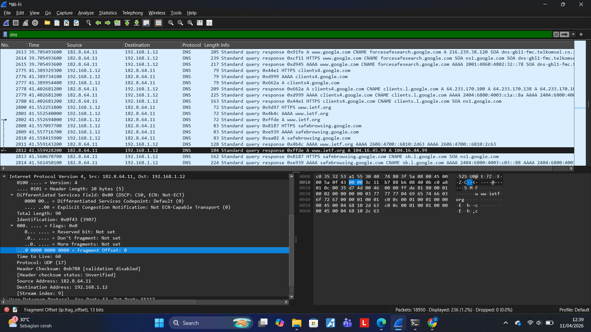
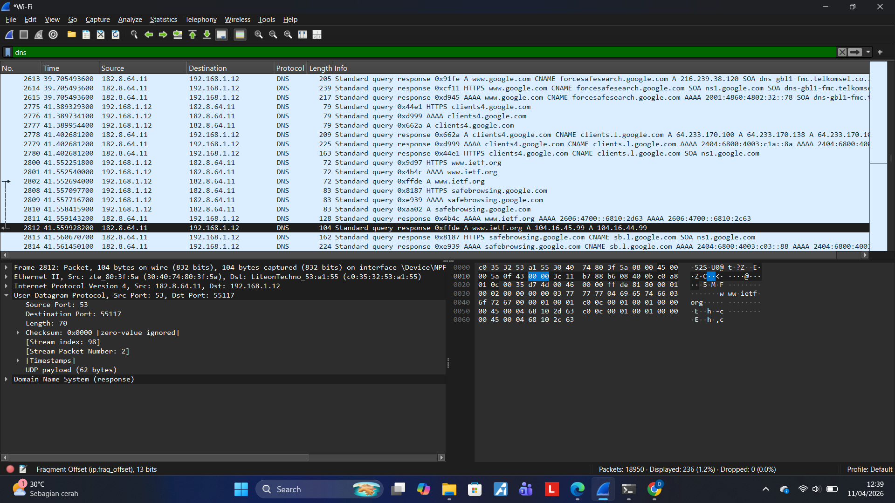
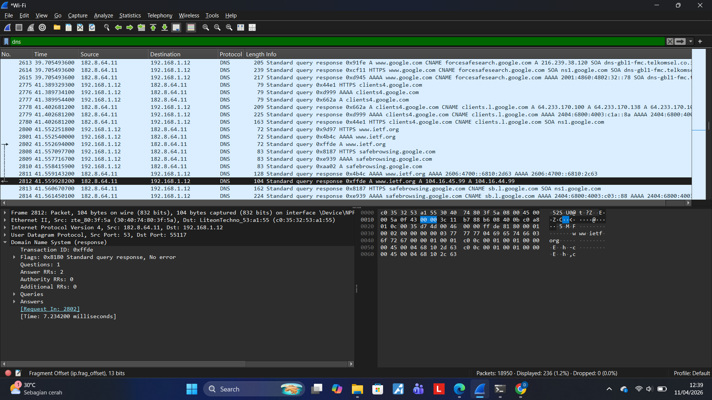
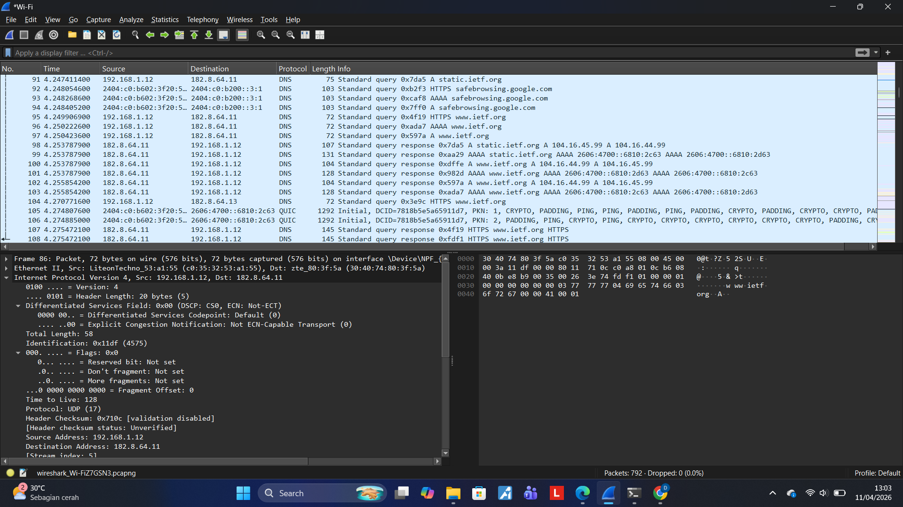

## Langkah Percobaan/Jawaban www.mit.edu

1. Apa port tujuan pada pesan permintaan DNS? Apa port sumber pada pesan balasan DNS?
Port Tujuan (Permintaan): 53. (Lihat Screenshot 221 pada bagian User Datagram Protocol, Dest Port: 53).
Port Sumber (Balasan): 53. (Lihat Screenshot 222 pada bagian User Datagram Protocol, Source Port: 53).

2. Ke alamat IP manakah pesan permintaan DNS dikirimkan? Apakah alamat IP tersebut merupakan default alamat IP server DNS lokal Anda?
Alamat IP Tujuan: 8.8.8.8. (Lihat Screenshot 221 pada bagian Internet Protocol Version 4, Dst: 8.8.8.8).
Analisis: Ya, alamat ini menjadi server DNS lokal Anda saat ini karena Anda telah mengaturnya secara manual (DNS Google), sehingga semua permintaan resolusi nama domain diarahkan ke sana.

3. Periksa pesan permintaan DNS. Apa "jenis" atau "type" dari pesan tersebut? Apakah pesan tersebut mengandung "jawaban" atau "answers"?
Jenis (Type): A (Host Address). (Lihat Screenshot 221 pada bagian Domain Name System (query) -> Queries).
Jawaban (Answers): Tidak mengandung jawaban atau Answer RRs: 0. Hal ini karena paket tersebut adalah paket pertanyaan (query) yang dikirim oleh komputer Anda, sehingga belum ada data jawaban di dalamnya.

4. Periksa pesan balasan DNS. Berapa banyak "jawaban" atau "answers" yang terdapat di dalamnya? Apa saja isi yang terkandung dalam setiap jawaban tersebut?
Jumlah Jawaban: Terdiri dari 3 jawaban (Answer RRs: 3). (Lihat Screenshot 222 pada bagian detail Domain Name System (response)).
Isi Jawaban: 
-CNAME: www.mit.edu diarahkan ke alias www.mit.edu.edgekey.net.
-CNAME: www.mit.edu.edgekey.net diarahkan lagi ke e9566.dscb.akamaiedge.net.
-address (A): Memberikan alamat IP akhir yaitu 23.217.163.122.

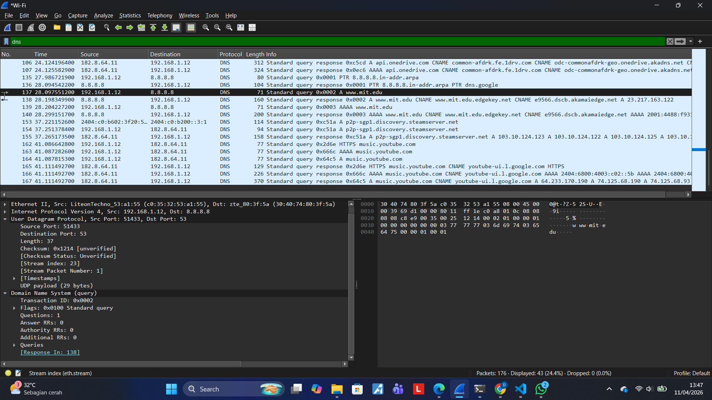
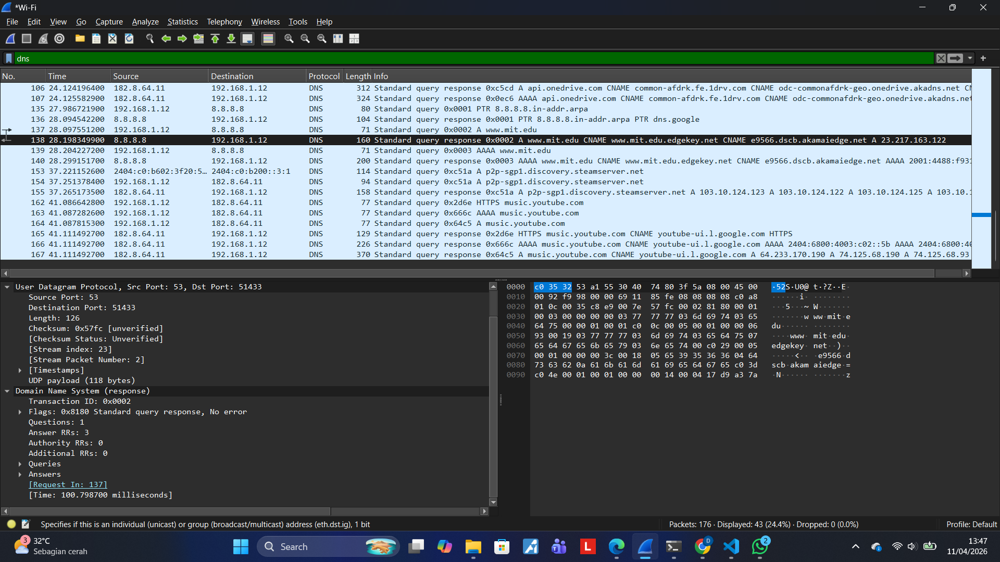

## Langkah Percobaan/Jawaban nslookup -type=NS mit.edu 8.8.8.8

1. Ke alamat IP manakah pesan permintaan DNS dikirimkan? Apakah alamat IP tersebut merupakan default alamat IP server DNS lokal Anda?
Alamat IP Tujuan: Pesan dikirimkan ke 8.8.8.8.
Analisis: Ya, ini adalah server DNS yang kamu gunakan. Berdasarkan data sebelumnya, kamu menggunakan DNS Google (8.8.8.8) yang dikonfigurasi secara manual, sehingga ia bertindak sebagai server DNS lokal untuk sesi ini.

2. Periksa pesan permintaan DNS. Apa "jenis" atau "type" dari pesan tersebut? Apakah pesan tersebut mengandung "jawaban" atau "answers"?
Jenis (Type): A (Host Address).
Jawaban (Answers): Tidak, pesan permintaan tersebut tidak mengandung jawaban (Answer RRs: 0) karena paket ini berfungsi untuk menanyakan informasi, bukan memberikan informasi.

3. Periksa pesan balasan DNS. Apa nama server MIT yang diberikan oleh pesan balasan? Apakah pesan balasan ini juga memberikan alamat IP untuk server MIT tersebut?
Nama Server MIT: Berdasarkan paket balasan (seperti pada Screenshot 222 sebelumnya), nama server yang diberikan adalah alias (CNAME) yaitu www.mit.edu.edgekey.net dan e9566.dscb.akamaiedge.net.
Alamat IP: Ya, pesan balasan memberikan alamat IP. Berdasarkan tangkapan layar kamu, alamat IP yang diberikan untuk server tersebut adalah 23.217.163.122

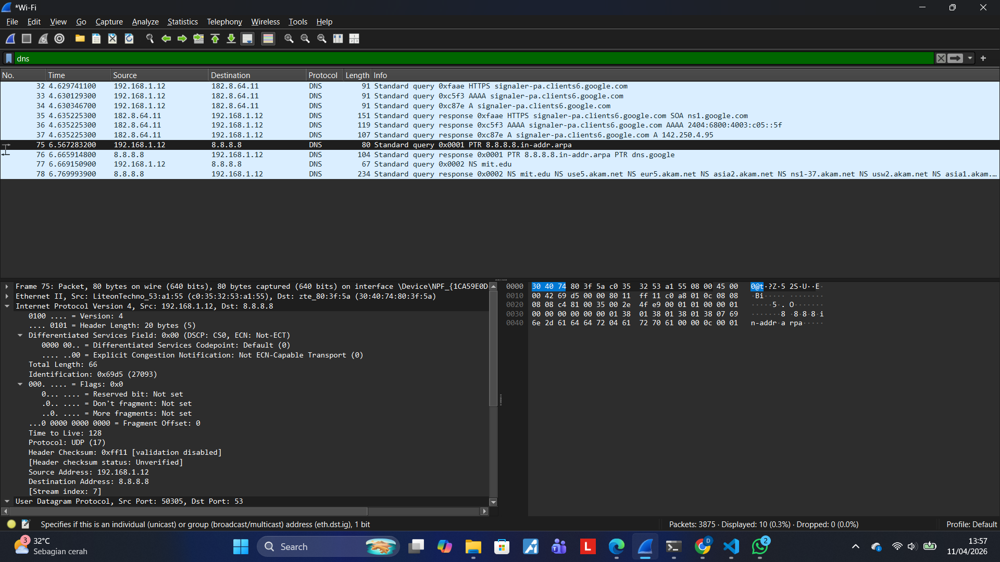
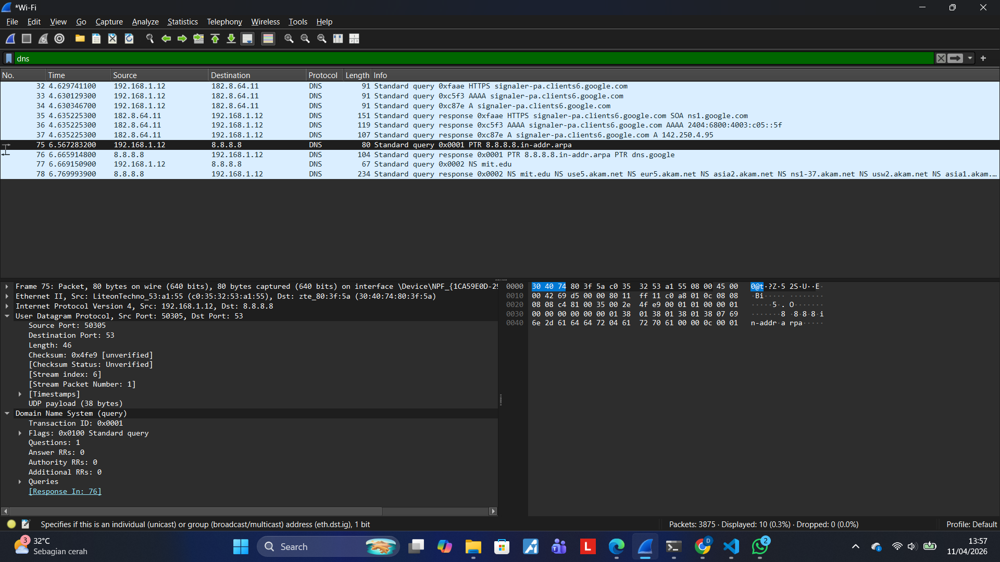

## Langkah Percobaan/Jawaban nslookup nslookup www.aiit.or.kr bitsy.mit.edu 8.8.8.8

1. Ke alamat IP manakah pesan permintaan DNS dikirimkan? Apakah alamat IP tersebut merupakan default alamat IP server DNS lokal Anda?
Alamat IP Tujuan: Pesan dikirimkan ke alamat IP 18.72.0.3.
Analisis: Tidak, ini bukan default server DNS Anda. Alamat IP ini adalah milik bitsy.mit.edu. Karena Anda memasukkan nama server tersebut di akhir perintah nslookup, komputer Anda dipaksa untuk mengirimkan pertanyaan langsung ke server tersebut, bukan ke DNS Google (8.8.8.8) yang biasa Anda gunakan.

2. Periksa pesan permintaan DNS. Apa "jenis" atau "type" dari pesan tersebut? Apakah pesan tersebut mengandung "jawaban" atau "answers"?
Jenis (Type): A (Host Address).
Jawaban (Answers): Tidak mengandung jawaban atau Answer RRs: 0. Paket ini murni merupakan permintaan informasi dari komputer Anda ke server bitsy.mit.edu.

3. Periksa pesan balasan DNS. Berapa banyak "jawaban" atau "answers" yang terdapat di dalamnya? Apa saja isi yang terkandung dalam setiap jawaban tersebut?
Jumlah Jawaban: Terdapat 1 jawaban (Answer RRs: 1).
Isi Jawaban: Jawaban tersebut berisi alamat IP untuk www.aiit.or.kr yaitu 210.104.184.130.

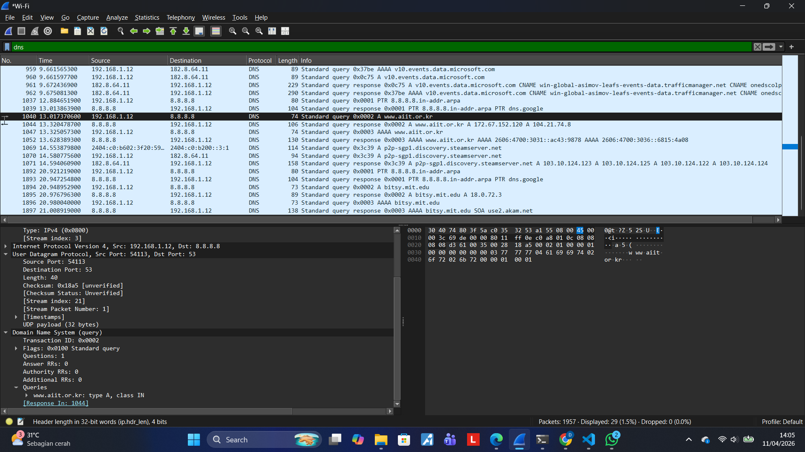
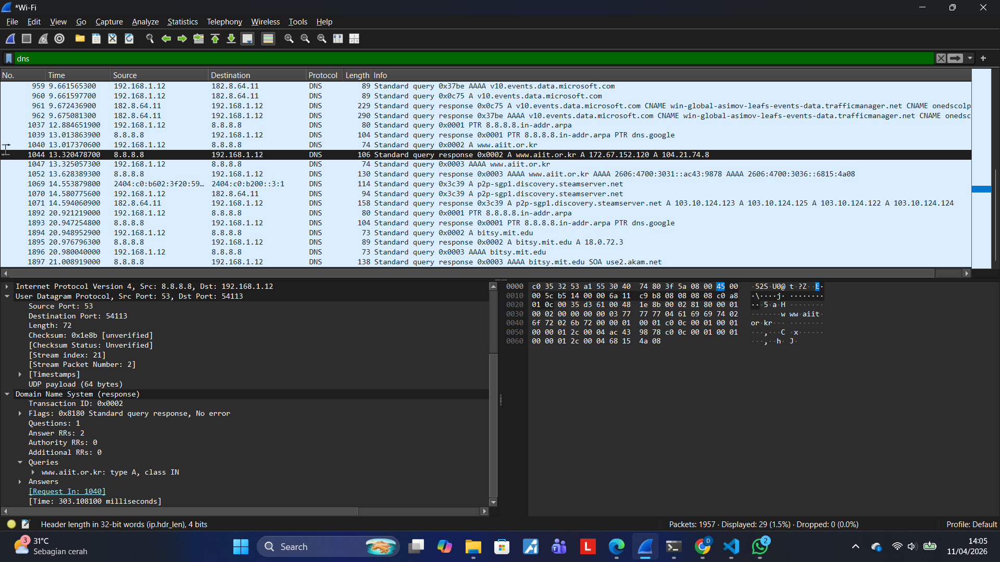
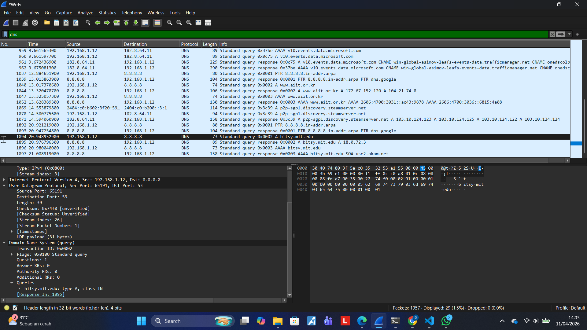
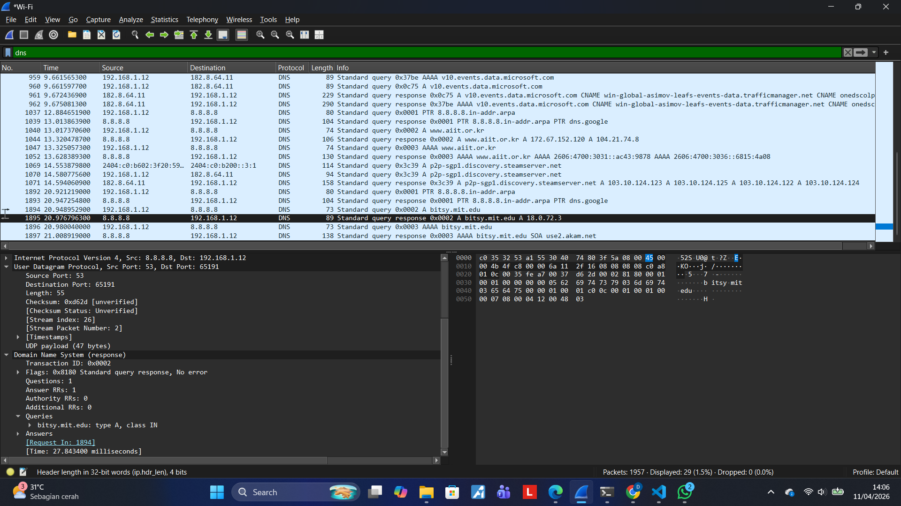