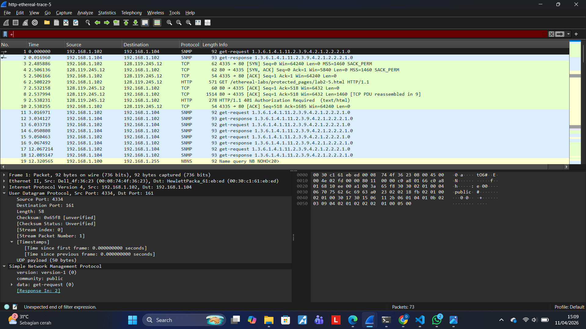
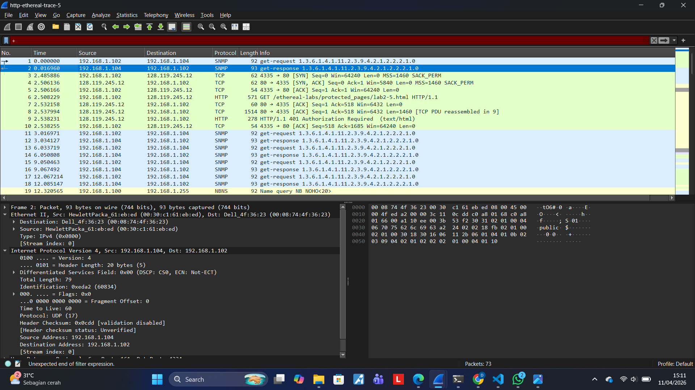

# Laporan Pratikum JK IF

## Tujuan Pratikum
Mempelajari Wireshark/UDP

## Langkah Percobaan/Jawaban 

1. Field pada Header UDP
Langkah: Lihat pada SS Screenshot (week5_1). Di bawah "User Datagram Protocol", bisa melihat daftar field-nya.
Jawaban: Terdapat 4 field, yaitu:
-Source Port (Port Sumber)
-destination Port (Port Tujuan)
-Length (Panjang)
-Checksum

2. Panjang Masing-masing Field (dalam Byte)
Langkah: Lihat pada panel Packet Bytes (kanan bawah) di SS Screenshot (week5_1). Saat klik salah satu field (misal Source Port), Wireshark menyorot 2 blok heksadesimal (misal 10 ee).
-Jawaban: Setiap field memiliki panjang 2 byte (16 bit).
-Total Header UDP = 8 byte

3.  Nilai pada Field "Length"Langkah: Pada SS Screenshot (week5_1), lihat nilai di samping field Length. Tertulis 58.
-Jawaban: Nilai "Length" menyatakan Total panjang Header UDP + Data (Payload).
-Verifikasi: * Header UDP = 8 byte.
-UDP Payload = 50 byte (tertera di SS : "UDP payload (50 bytes)").
-8 + 50 = 58. Jawaban terverifikasi sesuai trace.

4. Maksimum Byte Payload UDPLangkah: Gunakan teori ukuran field Length yang Anda temukan di No. 2 (16 bit).
-Jawaban: Karena field Length berukuran 16 bit, nilai maksimumnya adalah = 65.535 byte.
-Payload Maksimum: 65.535 - 8 header = 65.527 byte.

5. Nomor Port TerbesarLangkah: Sama dengan logika No. 4, field Port juga 16 bit.
Jawaban: Nomor port terbesar yang mungkin adalah 65.535

6. Nomor Protokol untuk UDP
Langkah: Lihat pada SS Screenshot (week5_2).jpg. Klik bagian Internet Protocol Version 4. Cari baris Protocol.
Jawaban:
-Desimal: 17
-Heksadesimal: 0x11 (Lihat di panel bytes saat baris "Protocol" diklik).

7. Pasangan Paket (Request & Response)
Langkah: Bandingkan paket No. 1 Screenshot (week5_1) dan paket No. 2 Screenshot (week5_2).
Analisis Paket 1 (Request):
Source Port: 4334
Destination Port: 161

Analisis Paket 2 (Response):
Source Port: 161
Destination Port: 4334

Jawaban: Kedua paket tersebut adalah pasangan yang sah karena port sumber dan tujuan saling bertukar (inverse). Ini menunjukkan komunikasi timbal balik antara IP 192.168.1.102 dan 192.168.1.104.

