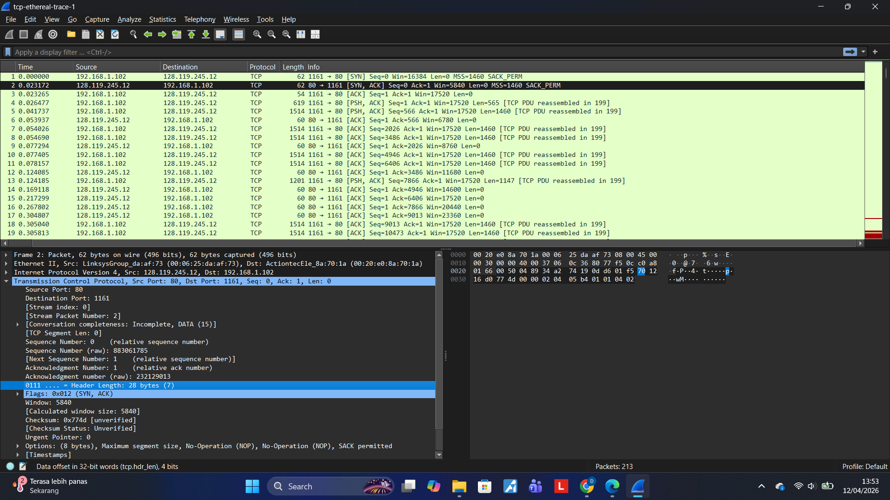
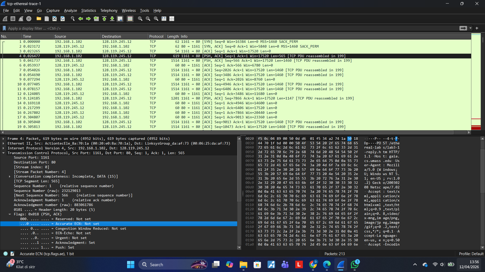
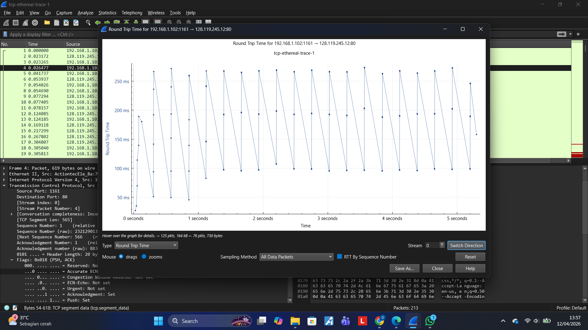
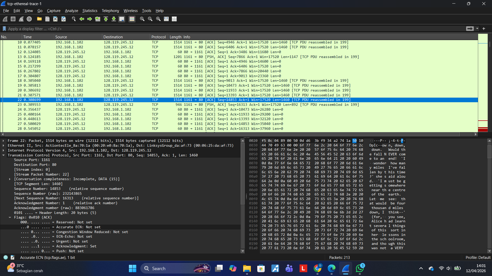
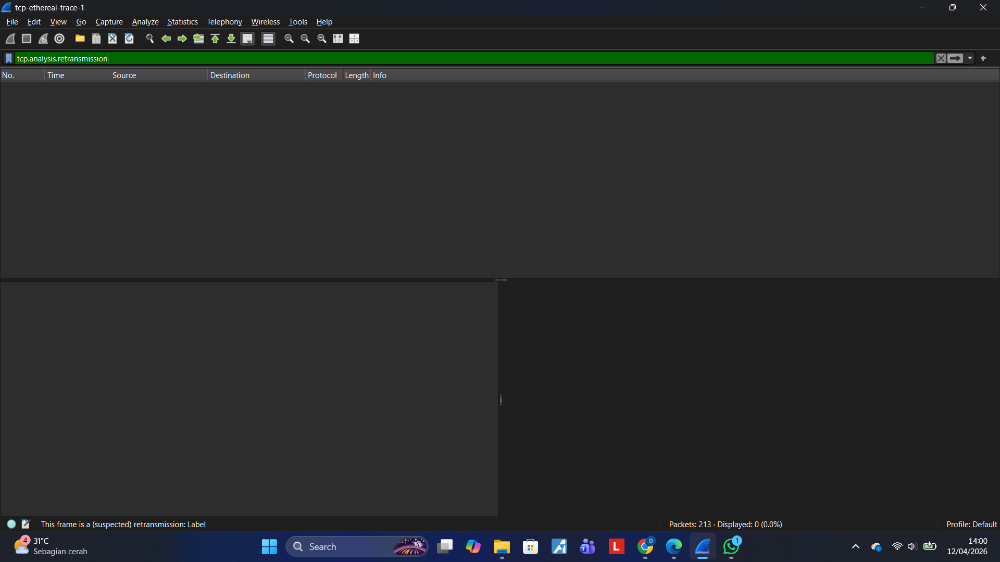
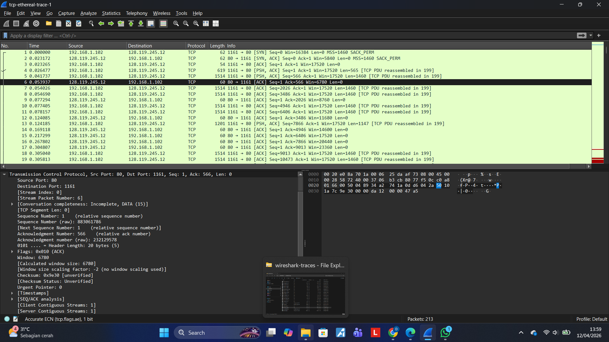
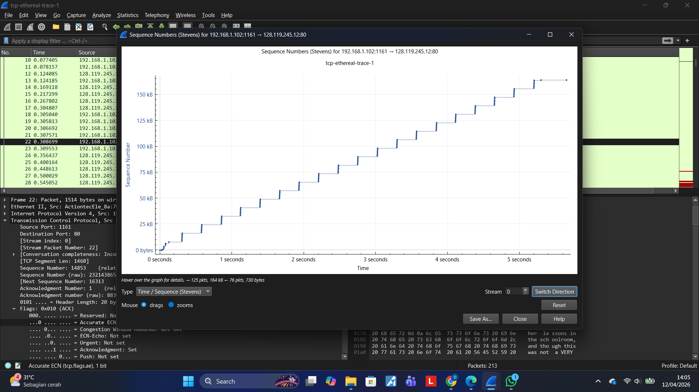

# Laporan Pratikum JK IF

## Tujuan Pratikum
Mempelajari Wireshark/TCP

## Langkah Percobaan/Jawaban 

1. Nomor Urut Segmen TCP SYN
-Nomor Urut (Relative Sequence Number): 0 (Lihat Screenshot week6_1, kolom Info atau panel detail Sequence Number: 0).
-Identifikasi sebagai SYN: Karena pada panel Flags, bit Syn bernilai Set (1). Ini menandakan inisiasi koneksi.

2. Nomor Urut SYNACK dan Nilai AcknowledgementNomor 
-Urut SYNACK: 0 (Lihat Screenshot week6_1,, paket nomor 2).
-Nilai Acknowledgement: 1.
-Cara Penentuan: Server (gaia.cs.umass.edu) mengambil Sequence Number awal dari klien (yaitu 0) lalu menambahnya dengan 1 (0 + 1 = 1) untuk menandakan bahwa server siap menerima byte berikutnya.
-Identifikasi sebagai SYNACK: Karena bit Acknowledgment dan Syn pada Flags keduanya bernilai Set (1).

3. Nomor Urut HTTP POST
-Nomor Urut: 1 (Lihat Screenshot week6_2, paket nomor 4).
-Penjelasan: Meskipun ini adalah paket data pertama, relative sequence number-nya adalah 1 karena ia melanjutkan setelah proses handshake selesai.

4. RTT dan EstimatedRTT (6 Segmen Pertama)
-Analisis RTT: Berdasarkan grafik pada Screenshot week6_3, nilai RTT berfluktuasi.
-RTT Segmen 1 (POST): Paket dikirim pada detik 0.026477 (No. 4) dan ACK diterima pada detik 0.053937 (No. 6). Maka $RTT = 0.053937 - 0.026477 = 0.02746 detik (27.46 ms).

5. Panjang Enam Segmen TCP Pertama
Dilihat dari Screenshot week6_3 dan week6_4 (kolom Length):
-Segmen 1 (No. 4): 565 byte (Data payload: 565).
-Segmen 2 (No. 5): 1460 byte.
-Segmen 3 (No. 7): 1460 byte.
-Segmen 4 (No. 8): 1460 byte.
-Segmen 5 (No. 10): 1460 byte.
-Segmen 6 (No. 11): 1460 byte.

6. Ruang Buffer (Receive Window)
-Jumlah Minimum: Berdasarkan Screenshot week6_6 (paket No. 6), Window Size yang diumumkan server adalah 6780. Namun, seiring berjalannya trace (Screenshot week6_4) nilai ini meningkat drastis (Win=11680, 20440, dst).
-Hambatan: Tidak, kurangnya ruang buffer tidak pernah menghambat pengiriman karena nilai Window Size terus meningkat dan tidak pernah menyentuh angka 0 (Zero Window).

7. Retransmisi
-Apakah ada? Tidak ada.
-Bukti: Berdasarkan Screenshot week6_5, saat Anda memasukkan filter tcp.analysis.retransmission, daftar paket kosong (0.0%). Artinya, semua paket terkirim dengan sukses dalam sekali coba.

8. Data yang Diakui dalam ACK
-Analisis: Penerima (server) biasanya mengakui data dalam jumlah besar. Contoh: Pada Screenshot week6_4 paket No. 24, server mengirim Ack=10473. Sebelumnya pada No. 20, Ack=9013. Selisihnya adalah 1460 byte.
-Kasus ACK per segmen: Ya, terlihat pada paket No. 5 dan No. 6, di mana satu segmen data langsung dibalas oleh satu ACK.

9. ThroughputLangkah Hitung: 
-Ambil waktu paket data terakhir (No. 23) = 0.309553.2.  
-Ambil waktu paket POST (No. 4) = 0.026477.3.  
-Total waktu = 0.309553 - 0.026477 = 0.283076 detik.4.
-Total Byte: Lihat Sequence Number terakhir (No. 23) yaitu 16313.5.  
-Throughput = 16313 / 0.283076 = 57.627$ byte/detik.

10. Analisis Fase "Slow Start" dan "Congestion Avoidance"
Dalam teori TCP, fase Slow Start ditandai dengan peningkatan jumlah data yang dikirim secara eksponensial, sedangkan Congestion Avoidance menunjukkan peningkatan yang lebih linear (melandai).
-Identifikasi Slow Start:
Fase ini terjadi pada awal transmisi, tepatnya pada rentang waktu 0 hingga sekitar 0.5 - 0.7 detik. Perhatikan bahwa di awal grafik, garisnya naik dengan sangat curam (hampir vertikal dalam tangga kecil). Ini menunjukkan bahwa setiap kali ACK diterima, Congestion Window (cwnd) berlipat ganda, sehingga pengirim mengirimkan lebih banyak paket dalam waktu singkat.
-Identifikasi Congestion Avoidance:
Setelah melewati detik ke-1, grafik mulai menunjukkan pola tangga yang sangat konsisten dan stabil secara diagonal. Fase ini mengambil alih ketika kurva tidak lagi naik secara eksponensial melainkan mengikuti garis lurus yang konstan hingga akhir transmisi (sekitar detik ke-5).
-Perbedaan dengan Perilaku Ideal:
Secara teori ideal, fase Slow Start seharusnya terlihat seperti kurva lengkung mulus ke atas (eksponensial). Namun, pada data yang Anda ukur, perubahannya terlihat sangat cepat dan langsung stabil menjadi linear. Hal ini bisa disebabkan oleh:
-Ukuran file yang kecil: Jika data tidak cukup besar, kita mungkin tidak sempat melihat kurva eksponensial yang sempurna.
-Limitasi Bandwidth: Klien mungkin langsung mencapai kapasitas maksimal jaringan (bottleneck) sehingga cwnd berhenti tumbuh eksponensial dan masuk ke mode stabil lebih cepat.

## Lampiran

