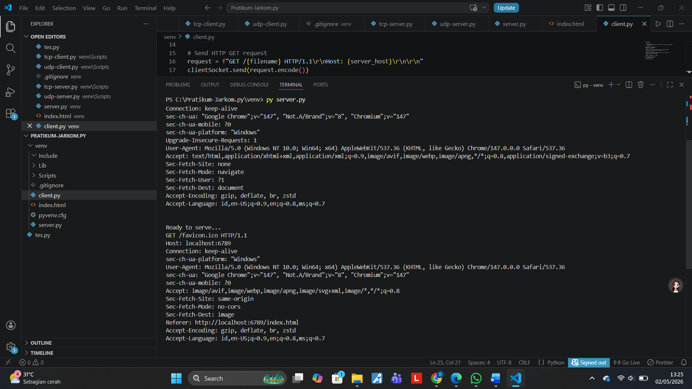
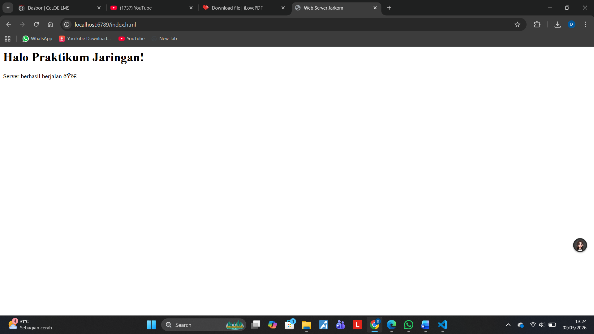
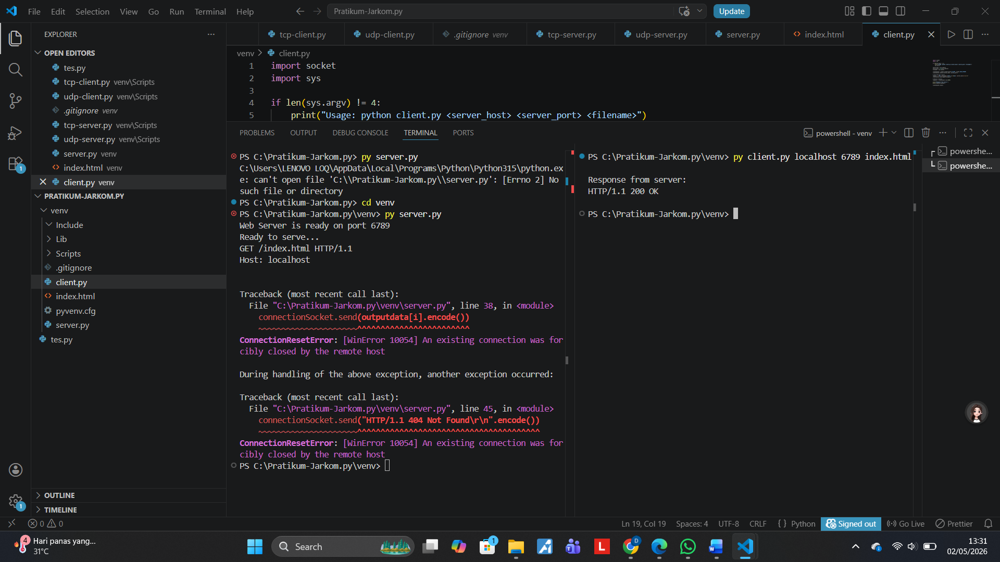

# Praktikum Jaringan Komputer – Modul 9
## Simple Python Web Server (TCP Socket)

### Tujuan
Membuat web server sederhana menggunakan TCP Socket Python yang mampu:
- Menerima HTTP request
- Mengirim file HTML
- Menangani error 404

## onsep Singkat

### TCP Socket
Socket adalah endpoint komunikasi jaringan.
Server:
- Bind port
- Listen
- Accept connection

Client:
- Connect ke server
- Kirim request

### HTTP Protocol
Contoh request:

GET /index.html HTTP/1.1 Host: localhost

Contoh response:

HTTP/1.1 200 OK

Status code:
- 200 OK → file ditemukan
- 404 Not Found → file tidak ada

## ▶️ Cara Menjalankan Server

python server.py

Buka browser:

http://localhost:6789/index.html

## 🧪 Testing dengan Client

python client.py localhost 6789 index.html

## 📸 Hasil Pengujian

### 1. Server Running

### 2. Akses via Browser

### 3. Error 404
Akses:

http://localhost:6789/test.html

### 4. Testing Client Python

## ✅ Kesimpulan
Web server berhasil:
- Menerima request HTTP
- Mengirim file HTML
- Menangani error 404
- Berjalan menggunakan TCP socket Python

